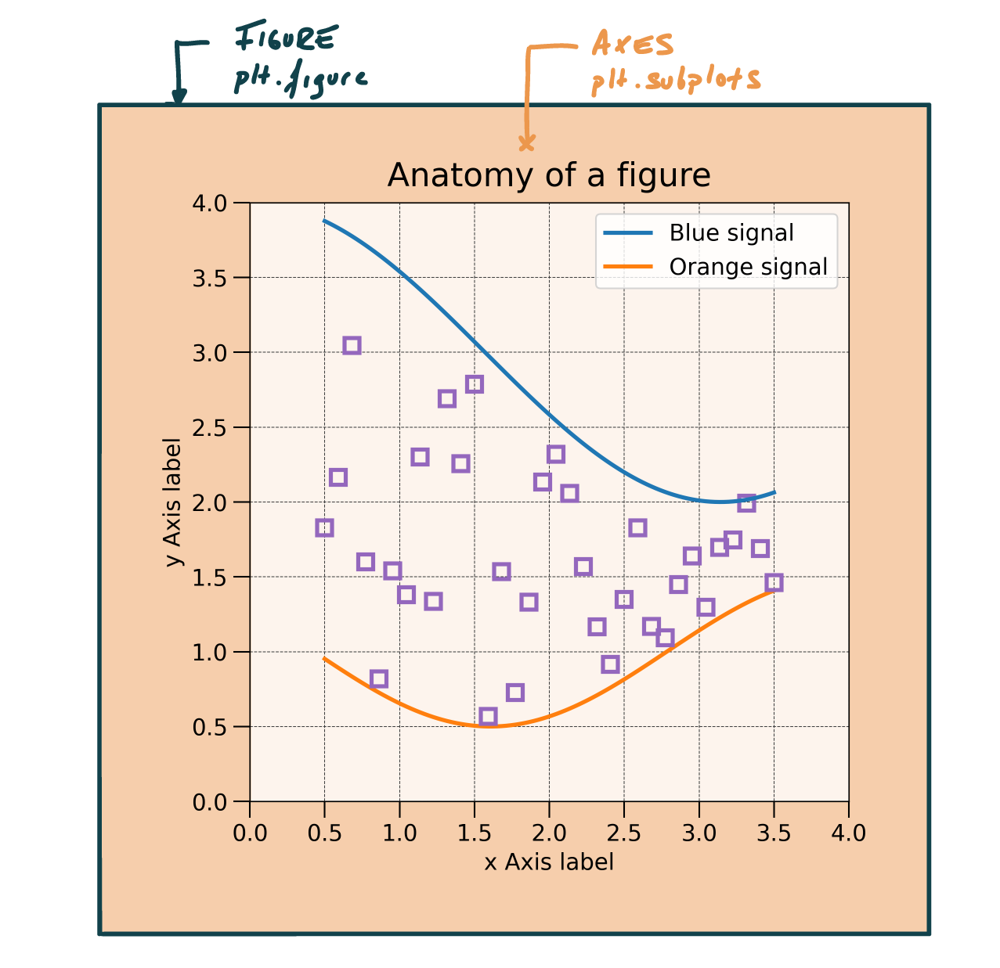
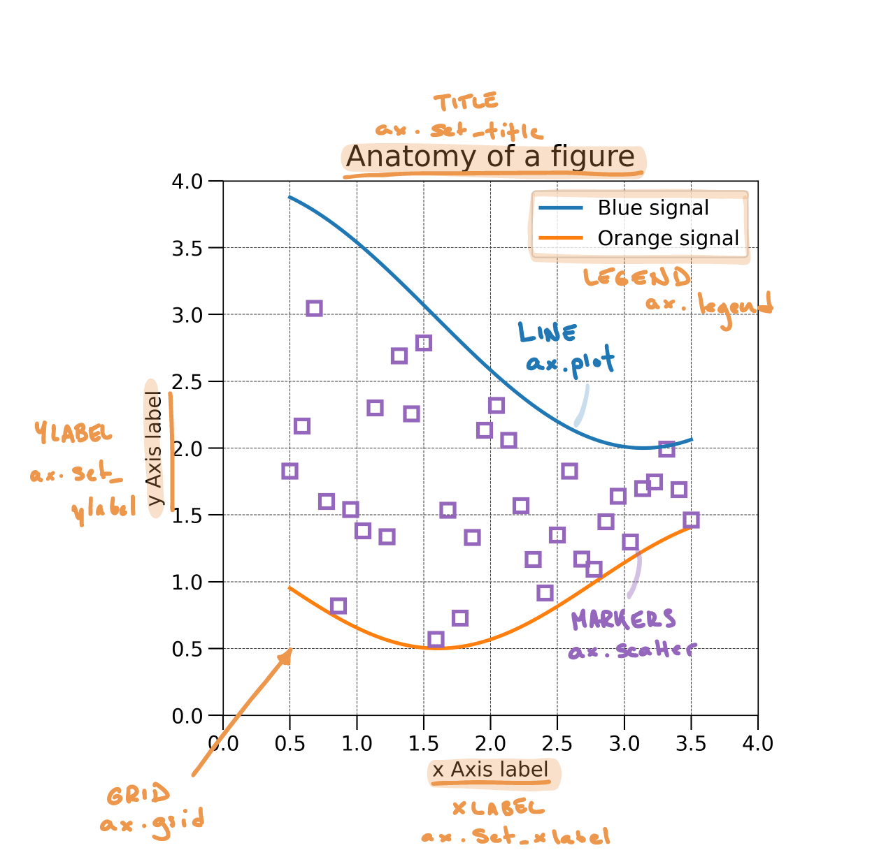

```{python}
#| echo: false
from pywebexercises.exercises import mcq, longmcq, torf
import matplotlib.pyplot as plt
plt.rcParams.update({
    "figure.facecolor":  (0.0, 0.0, 0.0, 0.0),  # red   with alpha = 30%
})
```


## Setting up the exercise

We start by importing libraries and the dataset. As in [the previous class](../class1/day1-2_pandas.qmd), we load the dataset using **Pandas**. The dataset comes from @Smith2011 and contains the chemical concentrations in volcanic tephra belonging to the recent activity (last 15 ky) of the Campi Flergrei Caldera (Italy). The dataset is contained in an Excel file that contains two sheets named `'Supp_majors'` and `'Supp_traces'`. In @lst-load-geochem, we use the `sheet_name` argument to the `read_excel()` ([doc](https://pandas.pydata.org/docs/reference/api/pandas.read_excel.html)) function to specify that we want to load the sheet containing trace elements.

```{python}
#| echo: true
#| lst-label: lst-load-geochem
#| lst-cap: caption

# Load libraries
import pandas as pd # Import pandas
import matplotlib.pyplot as plt # Import the pyplot module from matplotlib
import seaborn as sns # Import seaborn

# Import the dataset specifying which Excel sheet name to load the data from
df_majors = pd.read_excel('https://raw.githubusercontent.com/ELSTE-Master/Data-Science/main/Data/Smith_glass_post_NYT_data_majors.csv')
df_traces = pd.read_excel('https://raw.githubusercontent.com/ELSTE-Master/Data-Science/main/Data/Smith_glass_post_NYT_data_traces.csv')
```


Take a minute to explore both datasets using the material from [last week](../class1/day1-1_intro.qmd). Remember the [cheat sheets](../class1/day1-summary.qmd) for various Pandas functions. The typical questions you want to address are:

- What **columns** are contained in the DataFrame?
- What **types** of data are each columns? (e.g., integer → `int`, decimal values →`float`, strings → `objects` )
- What columns contain:
  - **Numerical data** → contain [measurable quantities]{.mark} in numerical format and allow mathematical operations
  - **Categorical data** → represent [categories or groups]{.mark} and describe *qualities* or *characteristics*, not quantities.


::: {.callout-note}
## Questions

Based on your exploration of the trace elements dataset:

- Is a [labelled]{.mark} **index** relevant? In other words, do we want to access **rows** using **[labels](../class1/day1-4_queries.qmd#label-based-indexing)** (→ `.loc`) or using **[positions](../class1/day1-4_queries.qmd#position-based-indexing)** (→ `.iloc`)?
- Same question for columns?

```{python}
#| echo: false
mcq({
    'Labels for index, labels for columns' : 1,
    'Labels for index, positions for columns' : 1,
    'Positions for index, labels for columns' : 1,
    'Positions for index, positions for columns' : 1,
})
```

::: {.callout-caution collapse="true"}
## Answer
There is no right or wrong! But looking at the data, using **positions for index** and **labels for columns** is probably the most logical way to go.
:::

- What column**s** can be used as grouping variables?

```{python}
#| echo: false
mcq({       
    'Analysis no.': 0,
    'Rb':  0, 
    'Strat. Pos.':  0,
    'Epoch':  1, 
    'Sc':  0,    
    'La':  0,    
    'Eruption':  1,   
    'Ce':  0,    
})
```

:::


::: {.callout-tip}
## Good reference book

The use of this dataset is inspired by the by the book *Introduction to Python in Earth Science Data Analysis: From Descriptive Statistics to Machine Learning* by @Petrelli2021.
:::


## Basics of plotting in Python {.unnumbered}

@lst-load-geochem also loads two libraries for plotting:

- [**Matplotlib**](https://matplotlib.org/stable/users/explain/quick_start.html) is [the library]{.mark} for plotting in Python. It allows for the finest and most comprehensive level of customisation, but it take some time to get used to. You can visit [Matplotlib's gallery](https://matplotlib.org/stable/gallery/index.html) to get some inspiration.
- [**Seaborn**](https://seaborn.pydata.org/tutorial/introduction) is [built on Matplotlib]{.mark}, but provides some higher-level functions to easily produce stats-oriented plots. It looks good by default, but finer customisation might be difficult and might result to using Matplotlib. Again, check out [Seaborn's gallery](https://seaborn.pydata.org/examples/index.html).

Here again, the idea is not to make you expert in *Matplotlib* or *Seaborn*, but rather to provide you with the minimum knowledge for you to further explore this tools in the context of your research.

::: {.callout-tip}
## Good plotting gallery

Trying to find some inspiration to get creative on data representation? Check out [The Python Graph Gallery](https://python-graph-gallery.com) website. 

:::

### Components of a Figure {.unnumbered}

Let's start to look at the basic components of a *Matplotlib* figure. There are two "hosts" to any plot (@fig-fig-anatomy-1):

1. A [**Figure**]{.mark} represents the main canevas;
2. [**Axes**]{.mark} are contained within the figure and is where most of the plotting will occur.

The easiest way to define a figure is using the `subplots()` function ([doc](https://matplotlib.org/stable/api/_as_gen/matplotlib.pyplot.subplots.html); @lst-plt-set). Note that the code returns two variables - `fig` and `ax` - which are the figure and the axes, respectively.

```{python}

#| eval: false
#| lst-label: lst-plt-set
#| lst-cap: Define a figure and one axes.
#| 
import matplotlib.pyplot as plt
fig, ax = plt.subplots()
```

{#fig-fig-anatomy-1}


Most additional components of a plot are controlled via the `ax` variable, which can be used to (@fig-fig-anatomy-2):

- *Plot* (e.g., line plot or scatter plots)
- *Set labels* (e.g., x-label, y-label, title)
- Add various *components* (e.g., legend, grid)

{#fig-fig-anatomy-2}

::: {.callout-note}

## Plotting exercise

@lst-plt-ex1 defines a figure and plots some data. @tbl-mpl-basics and @fig-fig-anatomy-2 illustrate some of the most frequently used functions for customising plots.

Use these functions to customise @lst-plt-ex1. Some hints:

- Remember that a *function* takes some *arguments* provided between *parentheses* (e.g., `ax.title(argument)`). Each function might accept different types of arguments.
- Titles and labels require a *string*, so remember to use `" "` or `' '`.
- For now, the legend does not require any argument, so you can leave the parentheses empty.
- Setting the grid requires one argument: do we want to show the grid (`True`) or not (`False`)

:::

| Function        | Description                        | Argument Type         | Example Argument           |
|-----------------|------------------------------------|-----------------------|----------------------------|
| [`ax.set_title`](https://matplotlib.org/stable/api/_as_gen/matplotlib.axes.Axes.set_title.html)    | Sets the title of the axes         | str                   | "My Plot Title"            |
| [`ax.set_xlabel`](https://matplotlib.org/stable/api/_as_gen/matplotlib.axes.Axes.set_xlabel.html)   | Sets the label for the x-axis      | str                   | "X Axis Label"             |
| [`ax.set_ylabel`](https://matplotlib.org/stable/api/_as_gen/matplotlib.axes.Axes.set_ylabel.html)   | Sets the label for the y-axis      | str                   | "Y Axis Label"             |
| [`ax.legend`](https://matplotlib.org/stable/api/_as_gen/matplotlib.axes.Axes.legend.html)       | Displays the legend                | None    | None (default)  |
| [`ax.grid`](https://matplotlib.org/stable/api/_as_gen/matplotlib.axes.Axes.grid.html)         | Shows grid lines                   | bool           | True             |

: Some of the most frequently used plotting functions. {#tbl-mpl-basics .striped   }

```{python}

#| lst-label: lst-plt-ex1
#| lst-cap: Define a figure and one axes.

import matplotlib.pyplot as plt # Import matplotlib

# Define some data
data1 = [1, 2, 3, 4, 5, 6, 7, 8, 9, 10]
data2 = [7, 3, 9, 1, 5, 10, 8, 2, 6, 4]

# Set the figure and the axes
fig, ax = plt.subplots()

# Plot the data
ax.plot(data1, data1, color='aqua', label='Line')
ax.scatter(data1, data2, color='purple', label='scatter')

# Customise the plot - up to you!
# - Add a title
# - Add x and y labels
# - Add a legend
# - Add a grid
```


## Plotting with Seaborn {.unnumbered}

Let's now review the use of **Seaborn**. You might wonder [why do we need another plotting library]{.mark}. Well, the topic of this module is [data exploration]{.mark}, and this is exactly what *Seaborn* is designed for. In addition, *Seaborn* perfectly integrates with *Pandas* - isn't that nice?

Over the next steps of the exercise we will use various types of plots offered by *Seaborn* to explore our geochemical dataset. @lst-sns-intro illustrates how to create a [scatterplot](https://seaborn.pydata.org/generated/seaborn.scatterplot.html) of the [Rubidium]{.mark} and [Strontium]{.mark} values contained in our dataset `df_traces`. *Seaborn* usually takes [4 arguments]{.mark}:

1. `ax`: The axes on which to plot the data
2. `data`: The DataFrame containing the data.
3. `x`: The name of the column containing the values used along x
4. `y`: The name of the column containing the values used along y

```{python}

#| lst-label: lst-sns-intro
#| lst-cap: Basic plotting using Seaborn.

# Define figure + axes
fig, ax = plt.subplots()
# Plot with seaborn (remember, we imported it as sns)
# df_traces is the geochemical dataset imported previously
sns.scatterplot(ax=ax, data=df_traces, x='Rb', y='Sr')
```


Should you feel adventurous and check out the [documentation](https://seaborn.pydata.org/generated/seaborn.scatterplot.html) of the `scatterplot` function, you would see that it is possible to use [additional arguments]{.mark} to further customize the plot:

- `hue`: Name of the variable that will produce points with [different colors]{.mark}.
- `size`: Name of the variable that will produce points with [different sizes]{.mark}.

::: {.callout-note}

## Seaborn exercise

Complete @lst-sns-intro, but use:

- The `"Epoch"` column to control points color.
- The `"SiO2* (EMP)"` column to control points size.

Remember, you can use `df.columns` to print a list of column names contained in the DataFrame.

- And if you are already done, take the time to explore and plot the `df_majors` dataset and plot some variables.

:::
