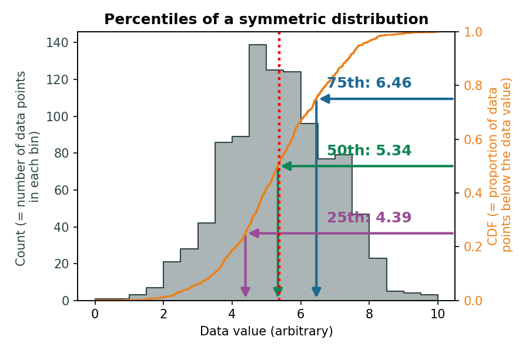
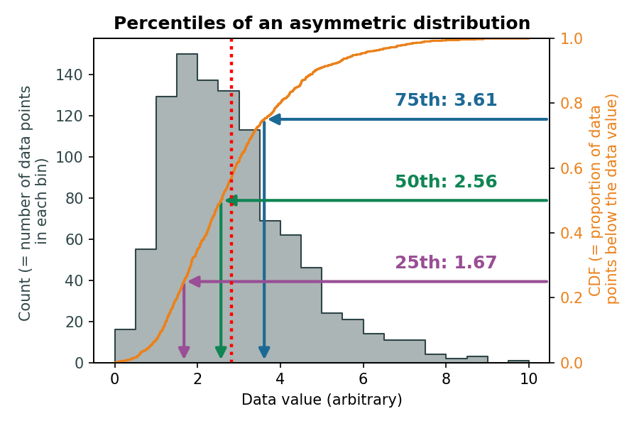
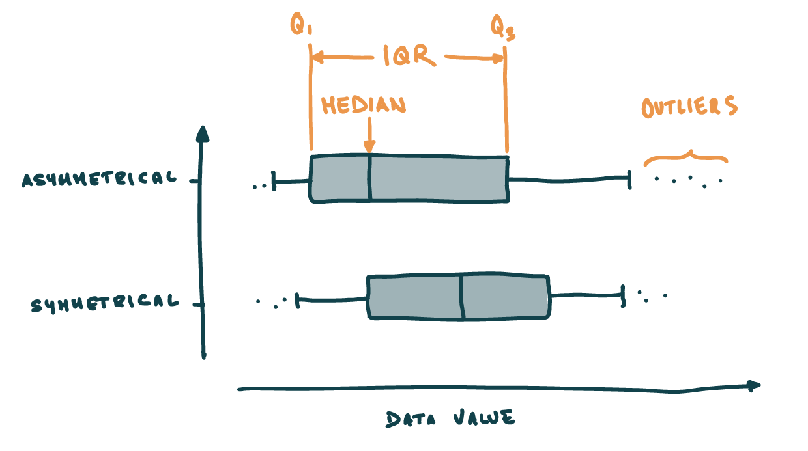

```{python}
#| echo: false
from pywebexercises.exercises import mcq, longmcq, torf
import matplotlib.pyplot as plt
plt.rcParams.update({
    "figure.facecolor":  (0.0, 0.0, 0.0, 0.0),  # red   with alpha = 30%
})

# Load libraries
import pandas as pd # Import pandas
import matplotlib.pyplot as plt # Import the pyplot module from matplotlib
import seaborn as sns # Import seaborn
import numpy as np

# Define the colours for plotting
blue = '#2F4647'
orange = '#EB811B'

# Import the dataset specifying which Excel sheet name to load the data from
df_majors = pd.read_csv('https://raw.githubusercontent.com/ELSTE-Master/Data-Science/main/Data/Smith_glass_post_NYT_data_majors.csv')
df_traces = pd.read_csv('https://raw.githubusercontent.com/ELSTE-Master/Data-Science/main/Data/Smith_glass_post_NYT_data_traces.csv')
```

The objective of **descriptive statistics** is to [provide ways of capturing the properties of a given data set or sample]{.mark}. Using *Pandas* and *Seaborn*, we will review some [metrics, tools, and strategies]{.mark} that can be used to summarize a dataset, providing us with a quantitative basis to talk about it and compare it to other datasets.


The first aspect of descriptive statistics is **univariate analyses**, which focus on [capturing the properties of **single** variables at the time]{.mark}. We are not yet concerned in characterising the [relationships]{.mark} between two or more variables. The following sections introduce basic functions to visually analyse single variables and the most important parameters to describe them.

## Plotting data distributions {.unnumbered}

Let's focus on the Zircon concentration in Campi Flegrei's geochemical dataset. We start by simply [visualising]{.mark} the dataset to get an understanding of what we will talk about. The fist type of plot we will consider is a [histogram]{.mark}, which shows the [number of times a specific value occurs]{.mark} in a given variable. (@fig-sns-hist). 


Visualising the dataset is a good way to start getting an idea of its structure. A [histogram]{.mark} can be seen as a simple [estimator of the underlying probability distribution]{.mark} of the variable:

- For a [discrete random variable]{.mark}, this corresponds to the [probability mass function (pmf)]{.mark}, denoted $p(x) = P(X = x)$, which assigns the probability that $X$ takes the value $x$.  
- For a [continuous random variable]{.mark}, this corresponds to the [probability density function (pdf)]{.mark}, denoted $f(x)$, which describes how probability is distributed over intervals: the probability that $X$ lies in an interval $[a,b]$ is given by $\int_a^b f(x)\,dx$.

It is important to differentiate between **theoretical distributions** (e.g., normal, log-normal etc) and the distribution of the **sample**, for which we often don't know the distribution. @fig-sns-hist_theoretical shows:

- Orange line → **a continuous theoretical distribution** (here a normal distribution)
- Blue histogram → **a discretised sample** (here taken from 1000 random numbers sampled from a normal distribution).

```{python}
#| label: fig-sns-hist_theoretical
#| fig-cap: Difference between theoretical distributions and sample histogram
#| echo: false

data = np.random.normal(size=1000)
fig, ax = plt.subplots()
sns.histplot(data=data, color=blue, alpha=.5, label='Sample')
# Compute normal pdf (using sample mean/std) and scale it to the histogram area, then plot it
mu, sigma = data.mean(), data.std()
x = np.linspace(-4,4, 300)
pdf = (1 / (sigma * np.sqrt(2 * np.pi))) * np.exp(-0.5 * ((x - mu) / sigma) ** 2)

# Scale pdf to histogram total area so the line matches the bar heights
hist_area = sum([p.get_height() * p.get_width() for p in ax.patches])
pdf_scaled = pdf * hist_area

ax.plot(x, pdf_scaled, color='orange', lw=2, label=f'Theoretical distribution')
ax.legend(frameon=False)
```


In *Seaborn*, **Histograms** can be plotted using [`sns.histplots()`](https://seaborn.pydata.org/generated/seaborn.histplot.html). Applied to our dataset, @fig-sns-hist) show the [number of times a specific Zr concentration occurs]{.mark} in the dataset.

```{python}
#| label: fig-sns-hist
#| fig-cap: Histogram of the Zirconium trace element


fig, ax = plt.subplots()
sns.histplot(data=df_traces, x='Zr')
ax.set_xlabel('Zr (ppm)');
ax.set_title('Zr distribution');

```

Note that **histograms** [discretise the data]{.mark} into equal **bins**. The [bin size]{.bg} (e.g., the width and numbers of bins) can alter the visual representation of the dataset. Although functions such as `sns.histplots()` rely on algorithm that suggest the optimal number of bins, it is a good practice to explore this parameter.


::: {.callout-note} 
## Your turn

- Histograms [discretise the data]{.mark} into equal **bins**. The documentation of [`sns.histplots()`](https://seaborn.pydata.org/generated/seaborn.histplot.html) shows that the function accepts various arguments (e.g., `bins`, `binwidth`, `binrange`) to modify how bins are defined. For now, let's focus on the `bins` argument, which takes an `int` number defining the number of bins. The number of bins can critically alter the representation of a histogram. For instance, try:
  - `bins=10`
  - `bins=100`
- Try and plotting more than one column to `sns.histplots()` (→ provide a list of column names to `x`). How does it look? What are the limitations?

:::

::: {.callout-tip}
## Visualising distributions of data with Seaborn

*Seaborn* has a [great tutorial](https://seaborn.pydata.org/tutorial/distributions.html#distribution-tutorial) on visualising distributions of data - be sure to check it out at some point!

:::

## Descriptive parameters {.unnumbered}

By looking at the distribution from @fig-sns-hist, we can intuitively understand the importance of describing [three different characteristics]{.mark} of the distribution:

- The **location** - or where is [the central value(s)]{.mark} of the dataset;
- The **dispersion** - or how [spread out]{.mark} is the distribution of data compared to the central values;
- The **skewness** - or how [symmetrical]{.mark} is the distribution of data compared to the central values;

These aspects can be quantified using different statistical measures. Some, like the expectation and variance, are based on [theoretical moments]{.mark} of the underlying random variable, while others, such as the median and interquartile range, rely on quantiles derived from the [cumulative distribution function]{.mark}. In practice, we do not know the distribution of the random variable of interest. Hence, we estimate these quantities on the sample by computing [estimators of these theoretical quantities]{.mark}.

### Location {.unnumbered}

We will review three measures of **location** and their corresponding estimators:

1. The expectation and the empirical [mean](#mean);
2. The median and the empirical [median](#median);
3. The mode and the empirical [mode](#mode).

#### Expectation and the empirical mean {.unnumbered}
The [expectation]{.mark} (or [theoretical mean]{.mark}) of a random variable $X$ represents the average value that $X$ would take over an infinite number of repetitions of the same experiment. It is defined as the [first moment]{.mark} of the distribution of $X$:

- For a [discrete]{.mark} random variable with probability mass function $p(x)$:  
$$\mathbb{E}[X] = \sum_x x\,p(x),$$ 

- For a [continuous]{.mark} random variable with probability density function $f(x)$:  
$$\mathbb{E}[X] = \int_{-\infty}^{\infty} x\,f(x)\,dx,$$

Intuitively, the expectation describes the [center of mass]{.mark} of the probability distribution.

The empirical counterpart of the expectation is the [mean]{.mark}. The [mean]{.mark} (or *arithmetic* mean - by opposition to *geometric* or *harmonic* means) is the [sum of the values divided by the number of values]{.mark} (@eq-mean):

$$
\bar{x} = \frac{1}{n} \sum_{i=1}^{n} x_i
$$ {#eq-mean}

The mean is meaningful to describe [**symmetric** distributions without **outliers**]{.mark}, where:

- **Symmetric** means the number of items above the mean should be roughly the same as the number below;
- **Outliers** are *extreme* values.

The empirical mean of a dataset can easily be computed with *Pandas* using the [`.mean()`](https://pandas.pydata.org/docs/reference/api/pandas.DataFrame.mean.html) function (@lst-univ-mean). Note that we round the results to two significant digits using `.round(2)`.

```{python}
#| lst-label: lst-univ-mean
#| lst-cap: Compute the mean for two significant digits.

df_traces[['Zr']].mean().round(2)
```


::: {.callout-note}
## Question

What is the empirical mean value for Strontium?

```{python}
#| echo: false
mcq({
    '365.38' : 0,
    '516.42' : 1,
    '219.38' : 0,
    '123.94' : 0,
})
```

:::


::: {.callout-tip}
## Descriptive stats functions

@lst-univ-mean shows how to compute the empirical mean on one column, but the `.mean()` function - as well as most fuctions for descriptive stats - can be applied to entire DataFrames. For this, we need to understand a critical argument - `axis`.

- `axis = 0` is usually the default, and computes the mean [across all rows for each column]{.mark}(@lst-univ-mean-multi-row)
- `axis = 1` usually makes sense when rows are labelled, and computes the mean [across all columns for each row]{.mark}(@lst-univ-mean-multi-col)

```{python}
#| lst-label: lst-univ-mean-multi-row
#| lst-cap: Compute the empirical mean across rows.
# Create a subset of the df_traces containing numerical data
df_traces_sub = df_traces[['Sc','Rb','Sr','Y','Zr','Nb','Cs']] 
# Compute the mean across all rows
df_traces_sub.mean(axis=0).round(2).head()

```

```{python}
#| lst-label: lst-univ-mean-multi-col
#| lst-cap: Compute the empirical mean across columns.

# Create a subset of the df_traces containing numerical data
df_traces_sub = df_traces[['Sc','Rb','Sr','Y','Zr','Nb','Cs']] 
# Compute the mean across all columns
df_traces_sub.mean(axis=1).round(2).head()
```


:::


#### Median and empirical median {.unnumbered}

The [median]{.mark} of a random variable $X$ is the value that splits the distribution into two equal halves in terms of probability. Formally, the [theoretical median]{.mark} $m$ satisfies:

$$
P(X \le m) \ge 0.5 \quad \text{and} \quad P(X \ge m) \ge 0.5,
$$

or equivalently, using the cumulative distribution function $F_X(x)$:

$$
F_X(m) = P(X \le m) = 0.5.
$$

In practice, we usually only observe a finite [sample]{.mark} of $X$. The [empirical median]{.mark} is an [estimator]{.mark} of the theoretical median, defined as the middle value of the sorted sample. There is no easy formula to compute the empirical median, instead we need to conceptually (@lst-univ-median-ex):

1. Order all values in ascending order and plot them against a normalised number of observations (this is called an empirical cumulative density function - or ECDF);
2. On the x-axis, find the point dividing the dataset into two equal numbers of observations;
3. Read the value on the y-axis that intersects the ECDF.

```{python}
#| lst-label: lst-univ-median-ex
#| lst-cap: Graphical representation of the empirical median.

fig, ax = plt.subplots(figsize=(6,4))
sns.ecdfplot(data=df_traces, x='Zr')
ax.plot([0, df_traces['Zr'].median()], [.5,.5], color='orange', linestyle='--')
ax.plot([df_traces['Zr'].median(), df_traces['Zr'].median()], [.5,0], color='orange', linestyle='--')
ax.set_xlim([0,900])
ax.set_ylim([0,1])
```

Fortunately, we can also use the native *Pandas* [`.median`](https://pandas.pydata.org/docs/reference/api/pandas.DataFrame.median.html) function (@lst-univ-median). 

```{python}
#| lst-label: lst-univ-median
#| lst-cap: Compute the median for two significant digits.

df_traces['Zr'].median().round(2)
```

::: {.callout-note}
## Question

What is the empirical median value for Cesium?

```{python}
#| echo: false
mcq({
    '36.38' : 0,
    '51.42' : 0,
    '23.99' : 1,
    '13.94' : 0,
})
```

:::


#### Mode and empirical mode {.unnumbered}

The [mode]{.mark} of a random variable $X$ is the value that occurs most frequently in the distribution. Formally, the [theoretical mode]{.mark} $x_\text{mode}$ is:

- For a [discrete]{.mark} variable: $x_\text{mode} = \arg\max_x p(x)$, where $p(x)$ is the probability mass function.  
- For a [continuous]{.mark} variable: $x_\text{mode} = \arg\max_x f(x)$, where $f(x)$ is the probability density function.

The [empirical mode]{.mark} is an [estimator]{.mark} of the theoretical mode, defined as the most frequent value in a sample (discrete) or the peak of a density estimate (continuous). A distribution can have one mode (unimodal), two modes (bimodal), or multiple modes (multimodal). In *Pandas*, the empirical mode is computed using [`.mode()`](https://pandas.pydata.org/docs/reference/api/pandas.DataFrame.mode.html).

For **categorical** or **discrete numerical data**, the empirical mode simply the value(s) that appear most often.

For **continuous data**, [exact duplicates may be rare]{.mark}, and resulting empirical modes might not be that meaningful (@fig-mode). As a result, we often bin the data into intervals first and find the most populated bin (@fig-mode-bin).

```{python}
#| code-fold: true
#| label: fig-mode
#| fig-cap: Modes computed from a continuous dataset.

# Calculate the modes
modes = df_traces['Zr'].mode().round(2)

# Set the histogram's bin width
binwidth = 50

# Plot the histogram
fig, ax = plt.subplots()
sns.histplot(data=df_traces, x='Zr', ax=ax, binwidth=50)

# Plot the modes
for i, m in enumerate(modes):
    ax.axvline(m, color='darkorange', lw=2)

ax.set_xlabel('Zr (ppm)')

plt.show()

```


```{python}
#| code-fold: true
#| label: fig-mode-bin
#| fig-cap: Empirical modes computed from a binned dataset.

# Set the histogram's bin width
binwidth = 50

# Make the bin range
minVal = int(df_traces['Zr'].min()) # Minimum value of the dataset, convert it to an integer
maxVal = int(df_traces['Zr'].max()) # Maximum value of the dataset, convert it to an integer
binsVal = range(minVal, maxVal, binwidth)
binned = pd.cut(df_traces['Zr'], bins=binsVal)
modes = binned.mode();


# Convert modes to numeric positions (handles numeric modes and Interval modes from pd.cut)
numeric_modes = []
for m in modes:
    numeric_modes.append((m.left + m.right) / 2)  # midpoint of the interval

# Plot the histogram
fig, ax = plt.subplots()
sns.histplot(data=df_traces, x='Zr', ax=ax, binwidth=50)

# Plot the modes
for i, mval in enumerate(numeric_modes):
    ax.axvline(mval, color='darkorange', lw=2)

ax.set_xlabel('Zr (ppm)')

plt.show()
```


#### Summary {.unnumbered}

@lst-univ-mean-med illustrate the values of the empirical mean and the empirical median relative to the distribution shown in the histogram. There are a few things to keep in mind when choosing between the empirical mean and median to estimate the location of a dataset:

- If a sample has a [symmetrical distribution]{.mark}, then **the mean and median are equal**.
- If the distribution of a sample is [not symmetrical]{.mark}, **the mean should not be used**.
- The [mean is highly sensitive to outliers]{.mark}, whereas the median is not.


```{python}
#| lst-label: lst-univ-mean-med
#| lst-cap: Compute the empirical median for two significant digits.
#| 
fig, ax = plt.subplots()
sns.histplot(data=df_traces, x='Zr')
ax.axvline(df_traces['Zr'].mean(), color='darkorange', lw=3, label='Mean')
ax.axvline(df_traces['Zr'].median(), color='darkviolet', lw=3, label='Median')
ax.legend()
```


### Dispersion {.unnumbered}

We will review three measures of [dispersion]{.mark} and their corresponding [estimators]{.mark}:

1. The range and the empirical [range](#range);  
2. The variance and standard deviation and the [sample variance and standard deviation](#variance-and-standard-deviation);  
3. The interquartile range and the empirical [interquartile range](#interquartile-range).


#### Range and empirical range {.unnumbered}

The [range]{.mark} of a random variable $X$ is the difference between its maximum and minimum values:

- The [theoretical range]{.mark} is defined as $R = \sup(X) - \inf(X)$, i.e., the difference between the largest and smallest possible values of $X$.  
- The [empirical range]{.mark} is computed from a [sample]{.mark} as the difference between the maximum and minimum observed values. For this, we need to get the minimum (`df.min()`) and maximum (`df.max()`) values, from which, when needed, the range can be calculated with @eq-range. It is however likely that the min/max functions will be more frequently used (@lst-univ-minmax).


$$
R_\text{emp} = \max(x_1, \dots, x_n) - \min(x_1, \dots, x_n).
$$ {#eq-range}


```{python}
#| lst-label: lst-univ-minmax
#| lst-cap: Compute the min and the max values of a column

df_min = df_traces['Zr'].min()
df_max = df_traces['Zr'].max()
df_range = df_max - df_min
print(f"The range of Zircon concentrations is {df_range:.2f}")

```

::: {.callout-warning}
## Don't use Python reserved keywords as variable names
Names as `min`, `max` or `range` represent native Python variables and **cannot be used as variable names!**
:::

::: {.callout-note}
## Question

What is the empirical range for Cesium?

```{python}
#| echo: false
mcq({
    '12.41' : 0,
    '414.6' : 0,
    '41.46' : 1,
    '53.88' : 0,
})
```

:::

#### Variance and standard deviation and sample variance and standard deviation  {.unnumbered}
The [variance]{.mark} and [standard deviation]{.mark} are two key measures of [dispersion]{.mark} that describe how spread out the values of a random variable $X$ are.

- The [theoretical variance]{.mark} is defined as:
$$
\mathrm{Var}(X) =  \mathbb{E}[(X - \mathbb{E}[X])^2],
$$
and the [theoretical standard deviation]{.mark} is its square root:
$$
\sigma = \sqrt{\mathrm{Var}(X)}.
$$

- The [sample variance]{.mark} $s^2$ estimates the spread of the data around the [sample mean]{.mark} $\bar{x}$:
$$
s^2 = \frac{\sum_{i=1}^{n} (x_i - \bar{x})^2}{n-1},
$$
where $x_1, \dots, x_n$ are the observed values and $n$ is the sample size.

- The [sample standard deviation]{.mark} $s$ is the square root of the [sample variance]{.mark}:
$$
s = \sqrt{s^2}.
$$


Both the [sample variance]{.mark} and [sample standard deviation]{.mark} describe the spread of the data. While the [variance]{.mark} is expressed in squared units of the observations, the [standard deviation]{.mark} is in the same units as the data, making it easier to interpret.

**Relation to the Gaussian distribution:**  
For a Gaussian (normal) distribution, about 68% of the data falls within one standard deviation of the mean, about 95% within two standard deviations, and about 99.7% within three standard deviations. Thus, variance and standard deviation are fundamental for describing the spread and probability intervals of normally distributed data.

You can compute these in pandas using `.var()` and `.std()`:

```{python}
#| lst-label: lst-univ-std
#| lst-cap: Compute the variance and standard deviation across columns.

# Compute the variance of a single column:
df_traces['Zr'].var()
# Compute the standard deviation of all columns in the DataFrame. In this case, you need to make sure that all columns are numerical.
df_traces_sub.std()

```


#### Interquartile range and the empirical interquartile range {.unnumbered}

If the **standard deviation** is valid only for [symmetrical]{.mark} distributions, what can we use for [asymmetrical]{.mark} ones? The **interquartile range** can help, but we first need to define [what are **percentiles**]{.mark}. We previously saw that the empirical [median](#median) represents the [value at the middle of the dataset]{.mark}, which means that:

- Half of the data points is **greater** than the empirical median;
- The other half is **smaller** than the empirical median.

The empirical **median** therefore represents the **50^th^ percentile** of the dataset. In a similar way, we can ask ourselves:

- *What is the value below which lie [25%]{.mark}  of the data?* → **25^th^ percentile**;
- *What is the value below which lie [75%]{.mark} of the data?* → **75^th^ percentile**.

@fig-univ-pctS and @fig-univ-pctA show the relationship between the percentiles and the underlying distribution of data, where:

- The blue area shows the [histogram]{.mark} (→ **how many** data points fall into a specific bin = discrete range of values?)
- The orange curve shows the [cumulative]{.mark} function (→ **what proportion** of data falls below a specific value?)

@fig-univ-pctS shows the percentiles of a **symmetric** distribution, and demonstrates how i) the median value **is equal** to the mean and ii) the 25^th^and 75^th^ percentile are **equally dispersed** around the median. In contrast, for **asymmetric** distributions, @fig-univ-pctA shows that i) the median and mean values **increasingly diverge** and ii) the 25^th^and 75^th^ percentile are **asymmetrically dispersed** around the median.


```{python}
#| code-fold: true

# Import the libraries
import numpy as np
import matplotlib.pyplot as plt
import seaborn as sns
from matplotlib.patches import FancyArrowPatch

# Function to plot the arrow
def plotArrow(ax,data,pct,c):
    arrowH = FancyArrowPatch(
        (ax.get_xlim()[1], pct/100), (np.percentile(data, pct), pct/100),
        arrowstyle='-|>',  # style: arrow with single head
        color=c,
        mutation_scale=15,  # size of arrow head
        linewidth=2
    )
    ax.add_patch(arrowH)

    value = np.percentile(data, pct)
    ax.text(8, pct/100 + 0.03, f"{pct}th: {value:.2f}", color=c, ha='center', va='bottom', fontsize=12, fontweight='bold')

    arrowD = FancyArrowPatch(
        (np.percentile(data, pct), pct/100), (np.percentile(data, pct), 0),
        arrowstyle='-|>',  # style: arrow with single head
        color=c,
        mutation_scale=15,  # size of arrow head
        linewidth=2
    )
    ax.add_patch(arrowD)
    # Plot the mean as a vertical red dotted line on the histogram axis
    ax.axvline(data.mean(), color='red', linestyle=':', linewidth=2)


# Setup random data using a Normal distribution
data = np.random.normal(size=1000)
data = (data - data.min()) / (data.max() - data.min())*10
datapct = np.percentile(data, [10, 25, 50, 75, 90])

# Set the plots
fig, ax = plt.subplots(figsize=(6, 4))

# Left y axis
sns.histplot(x=data, bins=20, color=blue, alpha=0.4, ax=ax, label='Density', element='step')
ax.set_xlabel('Data value (arbitrary)')
ax.set_ylabel('Count (= number of data points \nin each bin)', color=blue)
ax.tick_params(axis='y', labelcolor=blue)
ax.set_title('Percentiles of a symmetric distribution', fontweight='bold')

# Add a right y axis
ax2 = ax.twinx()
sns.ecdfplot(x=data, ax=ax2, color=orange, label='Cumulative density')
ax2.set_ylabel('CDF (= proportion of data\n points below the data value)', color=orange)
ax2.tick_params(axis='y', labelcolor=orange)

# Plot the arrows
plotArrow(ax2, data, 75, '#1D6996')
plotArrow(ax2, data, 50, '#0F8554')
plotArrow(ax2, data, 25, '#994E95')

fig.tight_layout()

fig.savefig("img/fig-univ-pctS.png", dpi=150, transparent=True)
plt.close(fig)
```

#| label: fig-univ-pctS
{#fig-univ-pctS width="80%"}


```{python}
#| code-fold: true

# Setup random data using a log-normal distribution
data = np.random.lognormal(size=1000, sigma=.4)
data = (data - data.min()) / (data.max() - data.min())*10
datapct = np.percentile(data, [10, 25, 50, 75, 90])

# Set the plots
fig, ax = plt.subplots(ncols=1, figsize=(6, 4))

# Left y axis
sns.histplot(x=data, bins=20, color=blue, alpha=0.4, ax=ax, legend=None, element='step')
ax.set_xlabel('Data value (arbitrary)')
ax.set_ylabel('Count (= number of data points \nin each bin)', color=blue)
ax.tick_params(axis='y', labelcolor=blue)
ax.set_title('Percentiles of an asymmetric distribution', fontweight='bold')

# Add a right y axis
ax2 = ax.twinx()
sns.ecdfplot(x=data, ax=ax2, color=orange, legend=None)
ax2.set_ylabel('CDF (= proportion of data\n points below the data value)', color=orange)
ax2.tick_params(axis='y', labelcolor=orange)

# Plot the arrows
plotArrow(ax2, data, 75, '#1D6996')
plotArrow(ax2, data, 50, '#0F8554')
plotArrow(ax2, data, 25, '#994E95')

fig.tight_layout()
fig.savefig("img/fig-univ-pctA.png", dpi=150, transparent=True)
plt.close(fig)
```

{#fig-univ-pctA width="80%"}

The [interquartile range]{.mark} ($IQR$) is the spread between the first ($Q_1$) and third ($Q_3$) quartiles, which represent the 25$^\text{th}$ and 75$^\text{th}$ percentiles, respectively (see @tbl-univ-pct and @tip-univ-pcr for a relationship between percentiles, quartiles, and deciles).  

- The [theoretical IQR]{.mark} of a random variable $X$ is defined as:
$$
IQR = Q_3 - Q_1 = F_X^{-1}(0.75) - F_X^{-1}(0.25),
$$
where $F_X^{-1}$ is the inverse of the cumulative distribution function of $X$.  

- The [empirical IQR]{.mark} is an [estimator]{.mark} of the theoretical IQR, computed from a [sample]{.mark} as the difference between the $75^\text{th}$ and $25^\text{th}$ percentiles of the observed data. It represents the range within which **50% of the sample values** lie:
$$
IQR_\text{emp} = Q_{3,\text{emp}} - Q_{1,\text{emp}}.
$$ {#eq-IQR}

The [IQR]{.mark} is a robust measure of [dispersion]{.mark}, less sensitive to extreme values than the [variance]{.mark} or [range]{.mark}.


::: {#tip-univ-pcr .callout-tip}
## Quartiles, deciles and percentiles

Using proportions of the dataset as measures of central tendencies and spread can be done using different strategies to divide the distribution, but they really refer to the same underlying values.  @tbl-univ-pct summarises the differences between quartiles, deciles and percentiles.


| **Measure**                | **Number of Divisions** | **Position(s) in Data / Percentile Equivalent**                           | **Description**                          |
| -------------------------- | ----------------------- | ------------------------------------------------------------------------- | ---------------------------------------- |
| **Quartiles (Q1, Q2, Q3)** | 4 equal parts           | Q1 = 25th percentile, Q2 = 50th percentile (median), Q3 = 75th percentile | Divides data into 4 equal-sized groups   |
| **Deciles (D1 … D9)**      | 10 equal parts          | D1 = 10th percentile, D2 = 20th percentile, …, D9 = 90th percentile       | Divides data into 10 equal-sized groups  |
| **Percentiles (P1 … P99)** | 100 equal parts         | P1 = 1st percentile, P2 = 2nd percentile, …, P99 = 99th percentile        | Divides data into 100 equal-sized groups |
: Relationship between quartiles, deciles and percentiles. {#tbl-univ-pct .striped}


:::


### Skewness and sample skewness {.unnumbered}

The [skewness]{.mark} measures [the asymmetry of a distribution]{.mark}, indicating whether the data are more spread out on one side of the [mean]{.mark} than the other.

- The [theoretical skewness]{.mark} of a random variable $X$ is defined as:
$$
\text{Skewness} = \frac{\mathbb{E}\big[(X - \mathbb{E}[X])^3\big]}{(\mathrm{Var}(X))^{3/2}},
$$


- The [sample skewness]{.mark} is an [estimator]{.mark} of the theoretical skewness, computed from a [sample]{.mark} $x_1, \dots, x_n$ and is computed as @eq-skew:
$$
\text{Skewness}_\text{emp} = \frac{1}{n} \sum_{i=1}^{n}\left(\frac{x_i-\bar{x}}{s}\right)^{3},
$$ {#eq-skew}

Positive skewness indicates a distribution with a longer right tail, while negative skewness indicates a longer left tail.

In *Pandas*, the skewness can be computed using `.skew()` (@lst-univ-skew). The returned value indicates:

- **0**: [Symmetric]{.mark} → e.g., normal distribution
- **>0**: [Righ-skewed]{.mark} → a tail extends to the right
- **<0**: [Left-skewed]{.mark} → a tail extends to the left


```{python}
#| echo: true
#| lst-label: lst-univ-skew
#| lst-cap: Skewness of the `Zr` dataset.

df_traces['Zr'].skew().round(2)

```


## Non-parametric distribution visualisation {.unnumbered}

We have reviewed several measures that describe the central tendency and spread of a dataset. Depending on the characteristics of the data, some measures are more informative than others. For instance, the [mean]{.mark} and [standard deviation]{.mark} provide a concise summary of the center and spread, but they can be heavily influenced by extreme values or skewed distributions. In contrast, measures based on [percentiles]{.mark}, such as the [interquartile range (IQR)]{.mark}, describe the spread of the data without being overly sensitive to outliers. The [IQR]{.mark} captures the range of the central $50\%$ of the data, giving a robust sense of variability even in asymmetrical distributions. Reporting additional percentiles, such as the $10^\text{th}$ and $90^\text{th}$, can further help to convey the shape and spread of the dataset, providing a more complete picture than a single range or standard deviation alone. 

One way to efficiently convey the structure of a dataset is through [non-parametric representations of distributions]{.mark}, which do not rely on assumptions about the underlying distribution. [Boxplots]{.mark} (or box-and-whiskers plots; @fig-boxplot) are a classic example: they summarize the data using a few key [quantiles]{.mark}, such as the [median]{.mark} and [interquartile range (IQR)]{.mark}. Because boxplots rely on these [order-based statistics]{.mark} rather than moments like the mean or variance, they are considered [non-parametric]{.mark}, making them especially useful for datasets that are skewed, contain outliers, or deviate from symmetry. By focusing on the spread and central tendency through quantiles, boxplots provide a robust visual summary of the data’s [location]{.mark}, [dispersion]{.mark}, and potential asymmetry.


- The **box** represents the $25^\text{th}$ and $75^\text{th}$ percentiles → $IQR$;
- The **horizontal line** within the **box** represents the **median**;
- The **whiskers** reprents a range that usually extends 1.5 times the IQR from the first and third quartiles
- Any point that lies beyond the whiskers is considered an **outlier**, which is a point that [significantly different from the majority of observations]{.mark}.

{#fig-boxplot width="80%"}


In *Seaborn*, box plots can be plotted using [`sns.boxplot()`](https://seaborn.pydata.org/generated/seaborn.boxplot.html). Two notes about box plots: 

1. They are useful to compare the **location** and **dispersion** between variables (@fig-sns-boxplot);
2. In *Seaborn*, whiskers extend by default 1.5 times the IQR from the first and third quartiles. This behaviour can be altered with the `whis` argument of `sns.boxplot()` (see the [doc](https://seaborn.pydata.org/generated/seaborn.boxplot.html))

*Seaborn* offers two alternatives to boxplots:

1. **Violin plots** ([`sns.violinplot()`](https://seaborn.pydata.org/generated/seaborn.violinplot.html)) are similar to box plots, but they approximate the underlying parametric data distribution using some smoothing algorithm (i.e. *kernel density estimation*). Without going into too much detail, this provides a good first approximation of the distribution, but [it can create some unrealistic artefacts]{.mark} (e.g., see the negative Sr concentrations in @fig-sns-violinplot).
2. **Boxen plots** ([`sns.boxenplot()`](https://seaborn.pydata.org/generated/seaborn.boxenplot.html)) are designed to better represent the non-parametric distriubtion of large dataset than box plots. They divide the datasets into **many quantiles** (not just Q1-Q3), and typically provide more resolution in the **tails** of the distribution (@fig-sns-boxenplot).

@tbl-sns provides a cheat sheet on which plot to use.


::: {.panel-tabset}

## Box plot

```{python}
#| label: fig-sns-boxplot
#| fig-cap: Visualising distributions using box-and-whisker plots.

fig, ax = plt.subplots()
sns.boxplot(data=df_traces[['Zr', 'Sr']], orient="h", ax=ax)
ax.set_xlabel('Concentration (ppm)');
ax.set_title('Zr and Sr distribution');
```

## Violin plot

```{python}
#| label: fig-sns-violinplot
#| fig-cap: Visualising distributions using violin plots.

fig, ax = plt.subplots()
sns.violinplot(data=df_traces[['Zr', 'Sr']], orient="h", ax=ax)
ax.set_xlabel('Concentration (ppm)');
ax.set_title('Zr and Sr distribution');
```

## Boxen plots

```{python}
#| label: fig-sns-boxenplot
#| fig-cap: Visualising distributions using boxen plots.

fig, ax = plt.subplots()
sns.boxenplot(data=df_traces[['Zr', 'Sr']], orient="h", ax=ax)
ax.set_xlabel('Concentration (ppm)');
ax.set_title('Zr and Sr distribution');
```

:::


| Feature             | Box Plot        | Boxen Plot        | Violin Plot        |
| ------------------- | --------------- | ----------------- | ------------------ |
| Data size           | Small/medium    | Large             | Any                |
| Shows tails well?   | No            | Yes             | Yes              |
| Shows data density? | No            | No              | Yes              |
| Complexity          | Simple          | Moderate          | High               |
| Implementation      | `sns.boxplot()` | `sns.boxenplot()` | `sns.violinplot()` |

: Simple rules on which plot to choose to represent data distributions. {#tbl-sns .striped   }

::: {.callout-note}
## Your turn

Take some time to get familiar with the use of these plotting functions!

- Plot different/more variables
- Check out the documentation
- Ask questions!

:::


## Grouping variables {.unnumbered}

Cool, we now have the tools to describe the behaviour of single [numerical]{.mark} variables. However, as described [here](#setting-up-the-exercise), we see that our dataset also contains [categorical]{.mark} variables, and we are going to see now how we can exploit them to apply what we just learned on **specific categories** of our dataset.

For the sake of simplicity, let's make a subset of the trace elements dataset, from which we select:

1. 5 [numerical]{.mark} data → *U*, *Sc*, *Hf*, *Zr*, *Sr*
2. 1 [categorical]{.mark} data → *Epoch*

*Panda* as a very handy function to [group data by categorical variables]{.mark}: `.groupby` ([doc](https://pandas.pydata.org/pandas-docs/stable/reference/api/pandas.DataFrame.groupby.html)). Let's compute the mean value of the different trace elements for each epoch (@lst-groupby):


```{python}
#| echo: true
#| lst-label: lst-groupby
#| lst-cap: Grouping data and computing the mean
df_traces_sub = df_traces[['Epoch', 'U', 'Sc', 'Hf', 'Zr', 'Sr']]
df_traces_sub.groupby(by='Epoch').mean()
```

Pretty handy don't you think? Note that you can apply all the functions described above (e.g., `.median()` or `.percentiles()`) to a `groupby` object. 

::: {.callout-note}
## Question
- Try and apply other statistical functions to your dataset.
- Looking at the [documentation](https://pandas.pydata.org/pandas-docs/stable/reference/api/pandas.DataFrame.groupby.html), it seems the `by` argument accepts a *label* (which is what we use in @lst-groupby) or a *list of labels*. Could it be that we can use more than one grouping variable? Such as `'Epoch'` and `'Eruption'`?
:::

