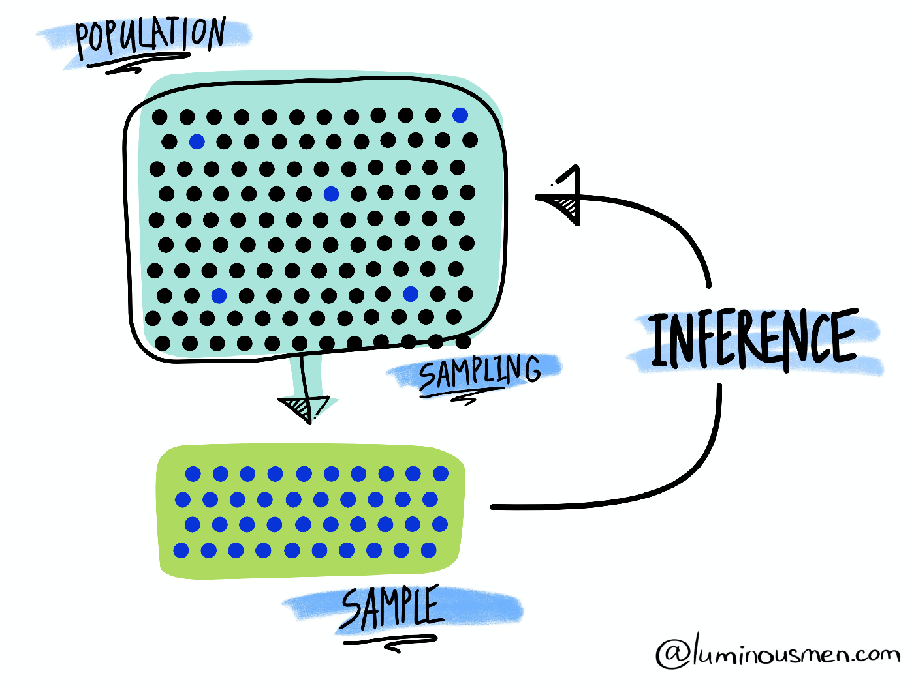
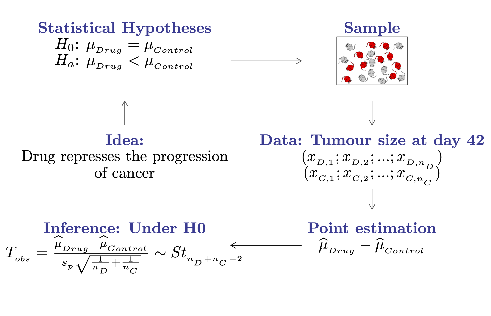
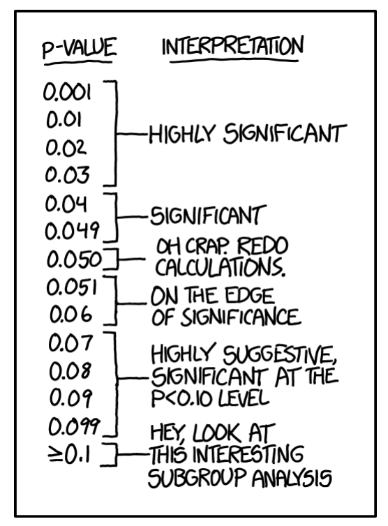
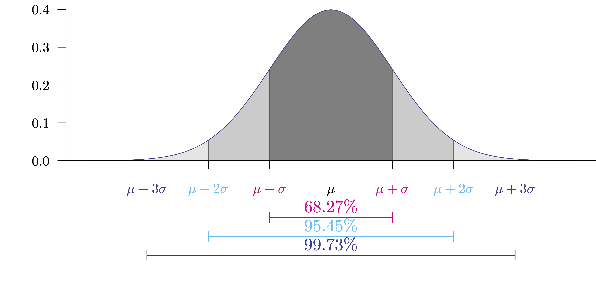
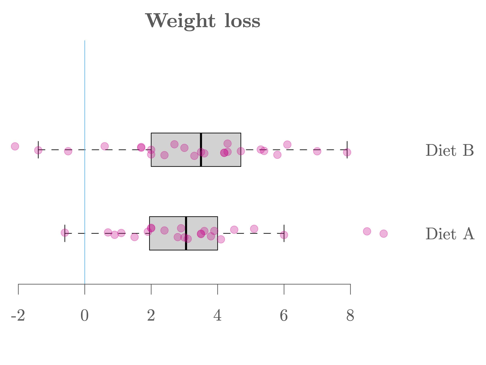
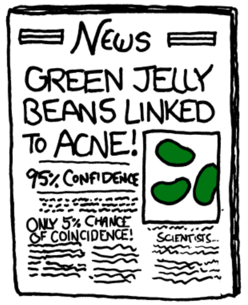
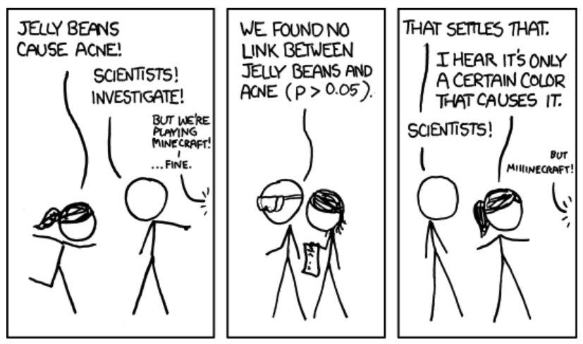
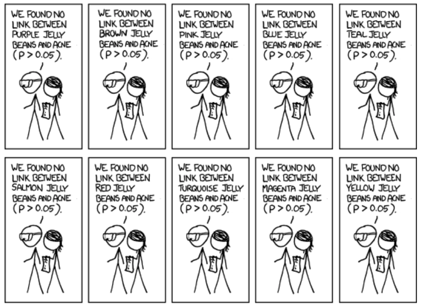
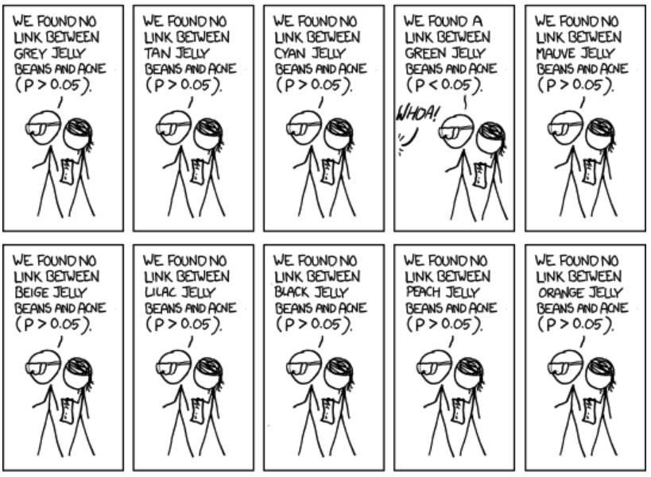
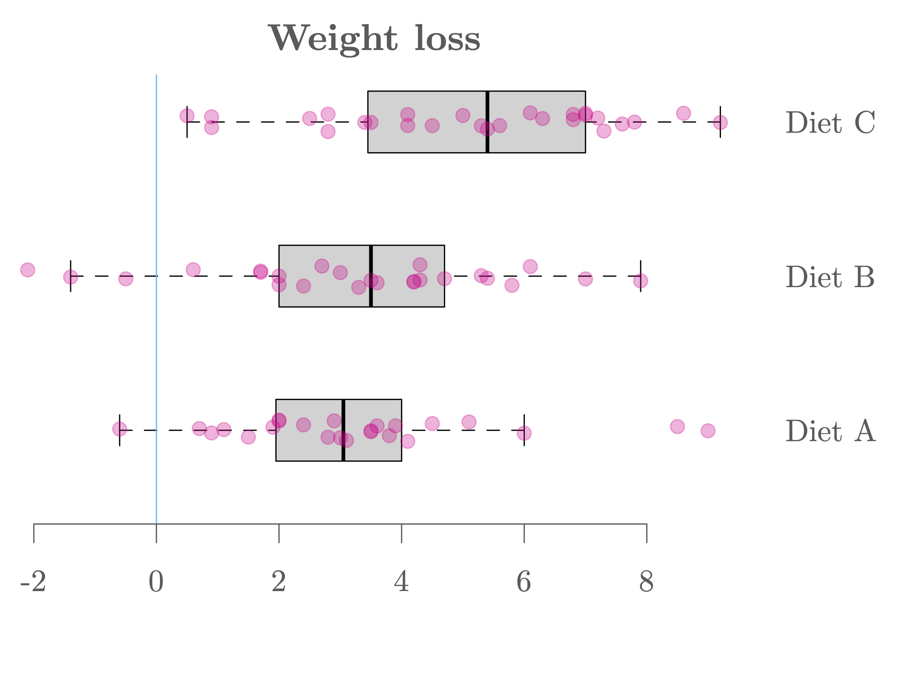

## How does it work? {.smaller}


```{css}
@media print {
  .has-continuation {
    display: block !important;
  }
}
```

```{r}
library(reticulate)
# use_condaenv("myenv", required = TRUE)
```

```{r, setup, include=FALSE}
# devtools::install_github("dill/emoGG")
library(pacman)
p_load(
  broom, tidyverse,
  latex2exp, ggplot2, ggthemes, ggforce, viridis, extrafont, gridExtra,
  kableExtra, snakecase, janitor,
  data.table, dplyr, estimatr,
  lubridate, knitr, parallel,
  lfe,
  here, magrittr
)

# Define pink color
red_pink <- "#e64173"
turquoise <- "#20B2AA"
orange <- "#FFA500"
red <- "#fb6107"
blue <- "#2b59c3"
green <- "#8bb174"
grey_light <- "grey70"
grey_mid <- "grey50"
grey_dark <- "grey20"
grey = "#b4b4b4"
purple <- "#6A5ACD"
slate <- "#314f4f"

# Knitr / chunk options
knitr::opts_chunk$set(
  comment = "",
  fig.align = "center",
  fig.height = 7,
  fig.width = 10.5,
  warning = FALSE,
  message = FALSE,
  dev = "svg"
)

options(device = function(file, width, height) {
  svg(tempfile(), width = width, height = height)
})
options(crayon.enabled = FALSE)
options(knitr.table.format = "html")

# ggplot themes used in original slides (kept for later plotting)
theme_empty <- theme_bw() + theme(
  line = element_blank(),
  rect = element_blank(),
  strip.text = element_blank(),
  axis.text = element_blank(),
  plot.title = element_blank(),
  axis.title = element_blank(),
  plot.margin = structure(c(0, 0, -0.5, -1), unit = "lines", valid.unit = 3L, class = "unit"),
  legend.position = "none"
)

theme_simple <- theme_bw() + theme(
  line = element_blank(),
  panel.grid = element_blank(),
  rect = element_blank(),
  strip.text = element_blank(),
  axis.text.x = element_text(size = 18, family = "STIXGeneral"),
  axis.text.y = element_blank(),
  axis.ticks = element_blank(),
  plot.title = element_blank(),
  axis.title = element_blank(),
  legend.position = "none"
)

theme_axes_math <- theme_void() + theme(
  text = element_text(family = "MathJax_Math"),
  axis.title = element_text(size = 22),
  axis.title.x = element_text(hjust = .95, margin = margin(0.15, 0, 0, 0, unit = "lines")),
  axis.title.y = element_text(vjust = .95, margin = margin(0, 0.15, 0, 0, unit = "lines")),
  axis.line = element_line(color = "grey70", size = 0.25,
                           arrow = arrow(angle = 30, length = unit(0.15, "inches"))),
  plot.margin = structure(c(1, 0, 1, 0), unit = "lines", valid.unit = 3L, class = "unit"),
  legend.position = "none"
)

theme_axes_serif <- theme_void() + theme(
  text = element_text(family = "MathJax_Main"),
  axis.title = element_text(size = 22),
  axis.title.x = element_text(hjust = .95, margin = margin(0.15, 0, 0, 0, unit = "lines")),
  axis.title.y = element_text(vjust = .95, margin = margin(0, 0.15, 0, 0, unit = "lines")),
  axis.line = element_line(color = "grey70", size = 0.25,
                           arrow = arrow(angle = 30, length = unit(0.15, "inches"))),
  plot.margin = structure(c(1, 0, 1, 0), unit = "lines", valid.unit = 3L, class = "unit"),
  legend.position = "none"
)

theme_axes <- theme_void() + theme(
  text = element_text(family = "Fira Sans Book"),
  axis.title = element_text(size = 18),
  axis.title.x = element_text(hjust = .95, margin = margin(0.15, 0, 0, 0, unit = "lines")),
  axis.title.y = element_text(vjust = .95, margin = margin(0, 0.15, 0, 0, unit = "lines")),
  axis.line = element_line(color = grey_light, size = 0.25,
                           arrow = arrow(angle = 30, length = unit(0.15, "inches"))),
  plot.margin = structure(c(1, 0, 1, 0), unit = "lines", valid.unit = 3L, class = "unit"),
  legend.position = "none"
)

theme_set(theme_gray(base_size = 20))

# Column names and helper functions retained
reg_columns <- c("Term", "Est.", "S.E.", "t stat.", "p-Value")

format_pvi <- function(pv) {
  ifelse(pv < 0.0001, "<0.0001", round(pv, 4) %>% format(scientific = FALSE))
}
format_pv <- function(pvs) lapply(X = pvs, FUN = format_pvi) %>% unlist()

tidy_table <- function(x, terms, highlight_row = 1, highlight_color = "black", highlight_bold = TRUE, digits = c(NA, 3, 3, 2, 5), title = NULL) {
  x %>%
    broom::tidy() %>%
    dplyr::select(1:5) %>%
    dplyr::mutate(
      term = terms,
      p.value = format_pv(p.value)
    ) %>%
    kableExtra::kable(
      col.names = reg_columns,
      escape = FALSE,
      digits = digits,
      caption = title
    ) %>%
    kableExtra::kable_styling(font_size = 20) %>%
    kableExtra::row_spec(1:nrow(broom::tidy(x)), background = "white") %>%
    kableExtra::row_spec(highlight_row, bold = highlight_bold, color = highlight_color)
}
```


Statistical methods are based on several fundamental concepts, the most central of which is to consider the information available (in the form of data) resulting from a <span style="color:#eb078e;">random process</span>.

As such, the data represent a <span style="color:#6A5ACD;">random sample</span> of a totally or conceptually accessible <span style="color:#6A5ACD;">population</span>.

Then, <span style="color:#eb078e;">statistical inference</span> allows to infer the properties of a population based on the observed sample. This includes deriving estimates and testing hypotheses.


```{r sampling, out.width="45%", echo=FALSE}


```
<span style="font-size:0.7em;">Source: [luminousmen](luminousmen.com)</span>

---


## Hypothesis testing {.smaller}

- In general (scientific) hypotheses can be translated into a set of (non-overlapping idealized) statistical hypotheses:

<div style="text-align:center;">
$$H_0: \theta\hspace{0.1cm} {\color{#eb078e}{\in}}\hspace{0.1cm}\Theta_0 \quad \text{and} \quad H_a: \theta\hspace{0.1cm} {\color{#eb078e}{\not\in}}\hspace{0.1cm}\Theta_0$$
</div>

- In a hypothesis test, the statement being tested is called the <span style="color:#6A5ACD;">null hypothesis</span> $\color{#373895}{H_0}$. A hypothesis test is designed to assess the strength of the evidence against the null hypothesis.
- The <span style="color:#6A5ACD;">alternative hypothesis</span> $\color{#373895}{H_a}$ is the statement we hope or suspect to be true instead of $\color{#373895}{H_0}$.
- Each hypothesis excludes the other, so that one can exclude one in favor of the other using the data.
- <span style="color:#eb078e;">Example:</span> a drug represses the progression of cancer

<div style="text-align:center;">
$$H_0: \mu_{\text{drug}}\hspace{0.1cm} {\color{#eb078e}{=}}\hspace{0.1cm}\mu_{\text{control}} \  \text{ and } \ H_a: \mu_{\text{drug}}\hspace{0.1cm}  {\color{#eb078e}{<}}\hspace{0.1cm}\mu_{\text{control}}.$$
</div>


---

## Hypothesis testing {.smaller}


```{R, out.width = "80%", echo = F}

```
---

## Hypothesis testing {.smaller}


<div style="font-size:1.1em;">

| **Outcome**         | **$H_0$ is true**                          | **$H_0$ is false**                        |
|--------------------|--------------------------------------------|-------------------------------------------|
| Can't reject $H_0$  | ✅ Correct decision (prob=$1-\alpha$)      | ⚠️ <span style="color:#ff5c5c;">Type II error (prob=$1-\beta$)</span> |
| Reject $H_0$        | ⚠️ <span style="color:#ff5c5c;">Type I error (prob=$\alpha$)</span> | ✅ Correct decision (prob=$\beta$)      |
</div>


<br>

<div style="font-size:0.9em;">

- The <span style="color:#eb078e;">type I error</span> corresponds to the probability of rejecting $H_0$ when $H_0$ is true (also called <span style="color:#eb078e;">false positive</span>). The <span style="color:#6A5ACD;">type II error</span> corresponds to the probability of not rejecting $H_0$ when $H_a$ is true (also called <span style="color:#6A5ACD;">false negative</span>).

<br>

- A test is of <span style="color:#eb078e;">significance level</span> $\color{#e64173}{\alpha}$ when the probability of making a type I error equals $\alpha$. Usually we consider $\alpha = 5\%$, however, this can vary depending on the context.

<br>

- A test is of <span style="color:#6A5ACD;">power</span> $\color{#6A5ACD}{\beta}$ when the probability to make a type II error is $1-\beta.$ In other words, the power of a test is its probability of rejecting $H_0$ when $H_0$ is false (or the probability of accepting $H_a$ when $H_a$ is true).

</div>
---

## What are p-values? {.smaller}

In statistics, the <span style="color:#6A5ACD; font-weight:bold;">p-value</span> is defined as the probability of observing a test statistic that is at least as extreme as actually observed, assuming that the null hypothesis $H_0$ is true.  

Informally, <span style="color:#eb078e;">a p-value can be understood as a measure of plausibility of the null hypothesis given the data</span>. A small p-value indicates strong evidence against $H_0$.  

When the p-value is small enough (i.e., smaller than the significance level $\alpha$), the test based on the null and alternative hypotheses is considered <span style="color:#eb078e;">significant</span>, meaning we reject the null hypothesis in favor of the alternative. This is generally what we want because it "verifies" our (research) hypothesis.  

When the p-value is not small enough, with the available data, we cannot reject the null hypothesis, so nothing can be concluded. 🤔  

The obtained p-value summarizes the <span style="color:#eb078e;">incompatibility between the data and the model</span> constructed under the set of assumptions.  

::: {.figure style="text-align:center;"}
<span style="font-size:0.9em; color:#6A5ACD;">"Absence of evidence is not evidence of absence."</span> <sup><span style="font-size:0.7em;">👋</span></sup>
:::

<span style="font-size:0.5em">👋 From the British Medical Journal.</span>

---

## How to understand p-values? {.smaller}

```{r, out.width = "30%", echo = F}

```

<span style="font-size:0.8em;">👋 If you want to know more have a look [here](https://xkcd.com/1478/).</span>

---

## P-values may be controversial {.smaller}

<span style="color:#eb078e;">P-values have been misused</span> many times because understanding what they mean is not intuitive!

::: {.figure style="text-align:center;"}

:::

<span style="font-size:0.8em;">👋 If you want to know more have a look [here](https://fivethirtyeight.com/features/statisticians-found-one-thing-they-can-agree-on-its-time-to-stop-misusing-p-values/).</span>

---

## Quick review: Normal distribution {.smaller}

<div style="font-size:80%">
$$Y\sim N(\mu,\sigma^{2}), \ \ \ \ \ f_{Y}(y) = \frac{1}{\sqrt{2\pi{\color{drawColor6} \sigma}^{2}}}\ e^{-\frac{(y-{\color{drawColor6} \mu})^{2}}{2{\color{drawColor6} \sigma}^{2}}}$$

$$\mathbb{E}[Y] = \mu, \ \ \ \ \ \ \ \ \ \ \ \ \text{Var}[Y] = \sigma^{2},$$

$$Z = \frac{Y-\mu}{\sigma} \sim N(0,1), \ \ \ \ \ f_{Z}(z) = \frac{1}{\sqrt{2\pi}}\ e^{-\frac{z^{2}}{2}}.$$

<span style="color:#6A5ACD;">Probability density function of a normal distribution:</span>
</div>


```{r, normal, out.width="60%", echo = F}

```


---

## Two-sample location tests {.smaller}

In practice, we often encounter problems where our goal is <span style="color:#eb078e;">to compare the means (or locations) of two samples</span>. For example,

1. A scientist is interested in comparing the vaccine efficacy of the Pfizer-BioNTech and the Moderna vaccine.

2. A bank wants to know which of two proposed plans will most increase the use of its credit cards.

3. A psychologist wants to compare male and female college students' impression on a selected webpage.

We will discuss three <span style="color:#eb078e;">two-sample location tests</span>:

1. <span style="color:#6A5ACD;">Two independent sample Student's t-test</span>

2. <span style="color:#6A5ACD;">Two independent sample Welch's t-test</span>

3. <span style="color:#6A5ACD;">Two independent sample Mann-Whitney-Wilcoxon test</span>

---

## Two independent sample Student's t-test {.smaller}

This test considers the following assumed model for group <span style="color:#6A5ACD; font-weight:bold;">A</span> and <span style="color:#06bcf1; font-weight:bold;">B</span>

<div style="text-align:center;">
$$X_{i(g)} = {\color{#eb078e}{\mu_{g}}}\hspace{0.1cm}+\hspace{0.1cm} \varepsilon_{i(g)} = \mu + {\color{#eb078e}{\delta_{g}}} \hspace{0.1cm}+\hspace{0.1cm} \varepsilon_{i(g)},$$
</div>
where $g=A,B$, $i=1,...,n_{g}$, $\varepsilon_{i(g)} \overset{iid}{\sim} N(0,\color{#eb078e}{\sigma^{2}}$$)$ and $\sum n_{g}\delta_{g} =0$. 

📝 $\color{#6A5ACD}{n_A}$ $=$ sample size of group <span style="color:#6A5ACD; font-weight:bold;">A</span>, $\color{#6A5ACD}{\mu_{A} = \mu + \delta_A}$ $=$ population mean of group <span style="color:#6A5ACD; font-weight:bold;">A</span>, $\color{#06bcf1}{n_B}$ and $\color{#06bcf1}{\mu_{B} = \mu + \delta_B}$ are similarly defined for group <span style="color:#06bcf1; font-weight:bold;">B</span>.

Hypotheses:

<div style="text-align:center;">
$H_0: \color{#6A5ACD}{\mu_A} \hspace{0.1cm}$$-\hspace{0.1cm} \color{#06bcf1}{\mu_B} \color{#eb078e}{=} \hspace{0.1cm}$$\mu_0\ \ \ \ \text{and} \ \ \ \ H_a: \color{#6A5ACD}{\mu_A}\hspace{0.1cm}$$-\hspace{0.1cm} \color{#06bcf1}{\mu_B} \ \hspace{0.1cm}$$\hspace{0.1cm} \big[ \color{#eb078e}{>}\hspace{0.1cm}$$\hspace{0.1cm} \text{ or } \color{#eb078e}{<}\hspace{0.1cm}$$\hspace{0.1cm} \text{ or } \color{#eb078e}{\neq}$$\big]\hspace{0.1cm}\mu_0.$
</div>

Test statistic's distribution under $H_0$:

$$
\color{#b4b4b4}{T = \frac{(\overline{X}_{A}-\overline{X}_{B})-\mu_0}{s_{p}\sqrt{n_{A}^{-1}+n_{B}^{-1}}} \ {\underset{H_0}{\sim}} \ \text{Student}(n_{A}+n_{B}-2).}
$$

---

## Discussion — Student's t-test {.smaller}

Python function:  


<div style="font-size: 1.5em;">
```{python, eval = FALSE, echo = TRUE}
from scipy import stats

stats.ttest_ind(a = ..., b = ..., alternative = ..., equal_var = True)
```
</div>

This test strongly relies on the <span style="color:#eb078e;">assumed absence of outliers</span>. If outliers appear to be present the Mann-Whitney-Wilcoxon test (see later) is (probably) a better option.

For moderate and small sample sizes, the sample distribution should be at least <span style="color:#eb078e;">approximately normal</span> with no strong skewness to ensure the reliability of the test.

In practice, the assumption of equal variance is hard to verify so <span style="color:#eb078e; font-weight:bold;">we recommend to avoid this test in practice</span>.


---

## Two independent sample Welch's t-test {.smaller}

This test considers the following assumed model for group <span style="color:#6A5ACD; font-weight:bold;">A</span> and <span style="color:#06bcf1; font-weight:bold;">B</span>

<div style="text-align:center;">
$$X_{i(g)} = {\color{#eb078e}{\mu_{g}}}\hspace{0.1cm}+\hspace{0.1cm} \varepsilon_{i(g)} = \mu + {\color{#eb078e}{\delta_{g}}} \hspace{0.1cm}+\hspace{0.1cm} \varepsilon_{i(g)},$$
</div>
where $g=A,B$, $i=1,...,n_{g}$, $\varepsilon_{i(g)} \overset{iid}{\sim} N(0,\color{#eb078e}{\sigma_g^{2}}$$)$ and $\sum n_{g}\delta_{g} =0$. 

📝 $\color{#6A5ACD}{n_A}$ $=$ sample size of group <span style="color:#6A5ACD; font-weight:bold;">A</span>, $\color{#6A5ACD}{\mu_{A} = \mu + \delta_A}$ $=$ population mean of group <span style="color:#6A5ACD; font-weight:bold;">A</span>, $\color{#06bcf1}{n_B}$ and $\color{#06bcf1}{\mu_{B} = \mu + \delta_B}$ are similarly defined for group <span style="color:#06bcf1; font-weight:bold;">B</span>.

Hypotheses:

<div style="text-align:center;">
$$H_0: {\color{#6A5ACD}{\mu_A}} \hspace{0.1cm}-\hspace{0.1cm} {\color{#06bcf1}{\mu_B}} {\color{#eb078e}{=}} \hspace{0.1cm}\mu_0\ \ \ \ \text{and} \ \ \ \ H_a: {\color{#6A5ACD}{\mu_A}}\hspace{0.1cm}-\hspace{0.1cm} {\color{#06bcf1}{\mu_B}} \ \hspace{0.1cm}\hspace{0.1cm} \big[ {\color{#eb078e}{>}}\hspace{0.1cm}\hspace{0.1cm} \text{ or } {\color{#eb078e}{<}}\hspace{0.1cm}\hspace{0.1cm} \text{ or } {\color{#eb078e}{\neq}}\big]\hspace{0.1cm}\mu_0.$$
</div>

Test statistic's distribution under $H_0$:

$$
\color{#b4b4b4}{T = \frac{(\overline{X}_{A}-\overline{X}_{B})-\mu_0}{\sqrt{s^2_A/n_{A} + s^2_B/n_{B}}} \ {\underset{H_0}{\sim}} \ \text{Student}(df).}
$$


---

## Discussion — Welch's t-test {.smaller}

Python function:  


<div style="font-size: 1.5em;">
```{python, eval = FALSE, echo = TRUE}

from scipy import stats

stats.ttest_ind(a = ..., b = ..., alternative = ..., equal_var = False)
```
</div>

This test strongly relies on the <span style="color:#eb078e;">assumed absence of outliers</span>. If outliers appear to be present the Mann-Whitney-Wilcoxon test (see later) is (probably) a better option.

For moderate and small sample sizes, the sample distribution should be at least <span style="color:#eb078e;">approximately normal</span> with no strong skewness to ensure the reliability of the test.

This test does not require the variances of the two groups to be equal. If the variances of the two groups are the same (which is rather unlikely in practice), the Welch's t-test loses a little bit of power compared to the Student's t-test.

The computation of $df$ (i.e. the degrees of freedom of the distribution under the null) is beyond the scope of this class.


---

## Mann-Whitney-Wilcoxon test {.smaller}

This test considers the following assumed model for group <span style="color:#6A5ACD; font-weight:bold;">A</span> and <span style="color:#06bcf1; font-weight:bold;">B</span>

<div style="text-align:center;">
$X_{i(g)} = \color{#eb078e}{\theta_{g}}\hspace{0.1cm}$$+\hspace{0.1cm} \varepsilon_{i(g)} = \theta + \color{#eb078e}{\delta_{g}} \hspace{0.1cm}$$+\hspace{0.1cm} \varepsilon_{i(g)}$,
</div>
where $g=A,B$, $i=1,...,n_{g}$, $\varepsilon_{i(g)} \overset{iid}{\sim} N(0,\color{#eb078e}{\sigma^{2}}$$)$ and $\sum n_{g}\delta_{g} =0$. 

📝 $\color{#6A5ACD}{n_A}$ $=$ sample size of group <span style="color:#6A5ACD; font-weight:bold;">A</span>, $\color{#6A5ACD}{\theta_{A} = \theta + \delta_A}$ $=$ population mean of group <span style="color:#6A5ACD; font-weight:bold;">A</span>, $\color{#06bcf1}{n_B}$ and $\color{#06bcf1}{\theta_{B} = \theta + \delta_B}$ are similarly defined for group <span style="color:#06bcf1; font-weight:bold;">B</span>.

Hypotheses:

<div style="text-align:center;">
$H_0: \color{#6A5ACD}{\theta_A} \hspace{0.1cm}$$-\hspace{0.1cm} \color{#06bcf1}{\theta_B} \color{#eb078e}{=} \hspace{0.1cm}$$\theta_0\ \ \ \ \text{and} \ \ \ \ H_a: \color{#6A5ACD}{\theta_A}\hspace{0.1cm}$$-\hspace{0.1cm} \color{#06bcf1}{\theta_B} \ \hspace{0.1cm}$$\hspace{0.1cm} \big[ \color{#eb078e}{>}\hspace{0.1cm}$$\hspace{0.1cm} \text{ or } \color{#eb078e}{<}\hspace{0.1cm}$$\hspace{0.1cm} \text{ or } \color{#eb078e}{\neq}$$\big]\hspace{0.1cm}\theta_0.$
</div>

Test statistic's distribution under $H_0$:

$$
\color{#b4b4b4}{Z = \frac{\sum_{i=1}^{n_{B}}R_{i(g)}-[n_{B}(n_{A}+n_{B}+1)/2]}{\sqrt{n_{A}n_{B}(n_{A}+n_{B}+1)/12}},}
$$
<span style="color:grey;">where</span> $\color{#b4b4b4}{R_{i(g)}}$ <span style="color:grey;">denotes the global rank of the</span> $\color{#b4b4b4}{i}$<span style="color:grey;">-th observation of group</span> $\color{#b4b4b4}{g}$<span style="color:grey;">.</span>

---

## Discussion – Mann–Whitney–Wilcoxon {.smaller}

Python function:

<div style="font-size: 1.5em;">
```{python, eval = FALSE, echo = TRUE}
from scipy import stats

stats.mannwhitneyu(a = ..., b = ...)
```
</div>


This test is "<span style="color:#eb078e;">robust</span>" in the sense that (unlike the t-tests) it is not overly affected by outliers.

For the Mann–Whitney–Wilcoxon test to be comparable to the t-tests (i.e. testing for the mean) we need to assume <span style="color:#6A5ACD; font-weight:bold;"> symmetric distributions </span> and <span style="color:#6A5ACD; font-weight:bold;"> equality in variances </span>.  

Then, we have $\color{#6A5ACD}{\theta_A = \mu_A}$ and $\color{#06bcf1}{\theta_B = \mu_B}$.
  
Compared to the t-tests, the Mann–Whitney–Wilcoxon test is less powerful if their requirements (Gaussian and possibly same variances) are met.

The distribution of this method under the null is complicated and can be obtained by different methods (e.g. exact, asymptotic normal, ...).  
The details are beyond the scope of this class.

---


## Comparing diets A and B {.smaller}

### Graph
```{r dietB, out.width="80%", echo=FALSE}

```
---


## Import
```{python, echo=TRUE}
# Import data
import pandas as pd
diet = pd.read_csv("https://raw.githubusercontent.com/ELSTE-Master/Data-Science/main/Data/diet.csv")
n = 5
print(diet.head(n)) #print the first n rows of the dataset

# Compute weight loss
diet["weight.loss"] = diet["initial.weight"] - diet["final.weight"]

# Select diet
posA = diet["diet.type"] == "A"
posB = diet["diet.type"] == "B"

# Variable of interest
dietA = diet["weight.loss"][diet["diet.type"]=="A"]
dietB = diet["weight.loss"][diet["diet.type"]=="B"]
```
---

## Student
```{python, echo=TRUE}
from scipy.stats import ttest_ind

t_stat, p_val = ttest_ind(dietA, dietB, alternative="two-sided", equal_var=True)

print("t-statistic:", round(t_stat, 4))
print("p-value:", round(p_val, 4))
```
---


## Welch
```{python, echo=TRUE}
from scipy import stats

# Welch's t-test (equal_var=False makes it Welch)
t_stat, p_value = stats.ttest_ind(dietA, dietB, equal_var=False)

print("t-statistic:", round(t_stat, 4))
print("p-value:", round(p_value, 4))
```
---


## Wilcox
```{python, echo=TRUE}
from scipy import stats

# Wilcoxon rank-sum test (Mann–Whitney U)
stat, p_value = stats.mannwhitneyu(dietA, dietB)

print("Wilcoxon statistic:", round(stat, 4))
print("p-value:", round(p_value, 4))
```
---


## Results

::: {.small-text}

- Step 1: <span style="color:#eb078e;">Define hypotheses </span>$H_0: \mu_A = \mu_B, \quad H_a: \mu_A \neq \mu_B$


\vspace{1cm}


- Step 2: <span style="color:#eb078e;">Define $\color{#eb078e}{\alpha}$</span> We consider $\alpha = 5\%$

\vspace{1cm}

- Step 3: <span style="color:#eb078e;">Compute p-value</span>  
Welch's *t*-test appears suitable in this case, and therefore, we obtain $\text{p-value} = 96.22\%$
(see Python output tab for details).

\vspace{1cm}

- Step 4: <span style="color:#eb078e;">Conclusion</span>  
We have $\text{p-value} > \alpha$
so we fail to reject the null hypothesis at the significance level of $5\%$.

:::

---

## Problems with multiple samples

<span style="font-size:0.8em;">
In practice, we often even encounter situations where we need to <span style="color:#eb078e;">compare the means of more than 2 groups</span>. For example, we want to compare the weight loss efficacy of several diets, say diets <span style="color:#6A5ACD; font-weight:bold;">A</span>, <span style="color:#06bcf1; font-weight:bold;">B</span>, <span style="color:#8bb174; font-weight:bold;">C</span>. Your theory could, for example, be the following: 0 < <span style="color:#6A5ACD;">$\mu_A$</span> <span style="color:black;">=</span> <span style="color:#06bcf1;">$\mu_B$</span> < <span style="color:#8bb174;">$\mu_C$</span>. A possible approach to evaluate its validity:


::: {.small-text}
1. Show that <span style="color:#8bb174;">$\mu_C$</span> is greater than <span style="color:#6A5ACD;">$\mu_A$</span> and <span style="color:#06bcf1;">$\mu_B$</span> (Test 1: $H_0:$ <span style="color:#6A5ACD;">$\mu_A$</span> $=$ <span style="color:#8bb174;">$\mu_C$</span>, $H_a:$ <span style="color:#6A5ACD;">$\mu_A$</span> $<$ <span style="color:#8bb174;">$\mu_C$</span>; Test 2: $H_0:$ <span style="color:#06bcf1;">$\mu_B$</span> $=$ <span style="color:#8bb174;">$\mu_C$</span>, $H_a:$ <span style="color:#06bcf1;">$\mu_B$</span> $<$ <span style="color:#8bb174;">$\mu_C$</span>). Here we hope to reject $H_0$ in both cases.

2. Show that <span style="color:#6A5ACD;">$\mu_A$</span> and <span style="color:#06bcf1;">$\mu_B$</span> are greater than 0 (Test 3: $H_0:$ <span style="color:#6A5ACD;">$\mu_A$</span> $=0$, $H_a:$ <span style="color:#6A5ACD;">$\mu_A$</span> $>0$; Test 4: $H_0:$ <span style="color:#06bcf1;">$\mu_B$</span> $=0$, $H_a:$ <span style="color:#06bcf1;">$\mu_B$</span> $>0$). Here we also hope to reject $H_0$ in both cases.

3. Compare <span style="color:#6A5ACD;">$\mu_A$</span> and <span style="color:#06bcf1;">$\mu_B$</span> (Test 5: $H_0:$ <span style="color:#6A5ACD;">$\mu_A$</span> $=$ <span style="color:#06bcf1;">$\mu_B$</span>, $H_a:$ <span style="color:#6A5ACD;">$\mu_A$</span> $\neq$ <span style="color:#06bcf1;">$\mu_B$</span>). Here we hope **not to reject $H_0$**. ⚠️ This does **not imply** that <span style="color:#6A5ACD;">$\mu_A$</span> $=$ <span style="color:#06bcf1;">$\mu_B$</span> is true, but at least the result would not contradict our theory.
</span>


:::

---

## Is there a problem in doing many tests? {.smaller}

<span style="color:#6A5ACD; font-weight:bold;">Are jelly beans causing acne?</span> Maybe... but why only <span style="color:green; font-weight:bold;">green</span> ones? 🤨

```{r green, out.width="45%", echo=FALSE}

```
<span style="font-size:0.7em;">Source: <a href="https://xkcd.com/882/">xkcd</a></span>


---

## Are jelly beans causing acne? {.smaller}

```{r green1, out.width="85%", echo=FALSE}

```

<span style="font-size:0.7em;">Source: <a href="https://xkcd.com/882/">xkcd</a></span>

---

## Maybe a specific color? {.smaller}

```{r green2, out.width="85%", echo=FALSE}

```

<span style="font-size:0.7em;">Source: <a href="https://xkcd.com/882/">xkcd</a></span>


---

## Maybe a specific color? {.smaller}

```{r green3, out.width="85%", echo=FALSE}

```

<span style="font-size:0.7em;">Source: <a href="https://xkcd.com/882/">xkcd</a></span>

---

## And finally... {.smaller}


```{r green4, out.width="85%", echo=FALSE}

```

<span style="font-size:0.7em;">Source: <a href="https://xkcd.com/882/">xkcd</a></span>


👋 <span class="smallest">If you want to know more about this comic, have a look <a href="https://www.explainxkcd.com/wiki/index.php/882:_Significant">here</a>.</span>


---

## Multiple testing can be dangerous! {.smaller}

<div style="font-size: 1.1em;">

- Remember that a p-value is <span style="color:#6A5ACD;">random</span> as its value depends on the data.
- If multiple hypotheses are tested, the chance of observing a rare event increases, and therefore, the chance to incorrectly reject a null hypothesis (i.e. making a Type I error) increases.
- For example, if we consider $k$ (independent) tests (whose null hypotheses are all correct), we have

$$\begin{align}
\alpha_k &= \Pr(\text{reject } H_0 \text{ at least once}) \\
&= 1 - \Pr(\text{not reject } H_0 \text{ test 1}) \times \ldots \times \Pr(\text{not reject } H_0 \text{ test k})\\
&= 1 - (1-\alpha) \times \ldots \times (1-\alpha) = 1 - (1-\alpha)^k
\end{align}$$

- Therefore, $\alpha_k$ increases rapidly with $k$ (e.g. $\alpha_1 = 0.05$, $\alpha_2 \approx 0.098$, $\alpha_{10} \approx 0.4013$, $\alpha_{100} \approx 0.9941$).
- Hence <span style="color:#eb078e;">performing multiple tests, with the same or different data, is dangerous</span> ⚠️ (but very common! 😟) as it can lead to significant results, when actually there are none!

</div>
---

## Possible solutions {.smaller}

<div style="font-size: 1.1em;">


Suppose that we are interested in making $k$ tests and that we want the probability of rejecting the null at least once (assuming the null hypotheses to be correct for all tests) $\alpha_k$ to be equal to $\alpha$ (typically 5%). Instead of using $\alpha$ for the individual tests we will use $\alpha_c$ (i.e. a corrected $\alpha$). Then, for $k$ (potentially <span style="color:#6A5ACD;">dependent</span>) tests we have

$$\begin{align}
\alpha_k &= \alpha = \Pr(\text{reject } H_0 \text{ at least once}) \\
&= \Pr(\text{reject } H_0 \text{ test 1} \text{ OR } \ldots \text{ OR } \text{reject } H_0 \text{ test k})\\
&{\color{#eb078e}{\leq}} \sum_{i = 1}^k \Pr(\text{reject } H_0 \text{ test i}) = \alpha_c \times k.
\end{align}$$

Solving for $\alpha_c$ we obtain: $\color{#6A5ACD}{\alpha_c = \alpha/k}$, which is called <span style="color:#eb078e;">Bonferroni correction</span>. By making use of the <span style="color:#eb078e;">Boole's inequality</span>, this approach does not require any assumptions about dependence among the tests or about how many of the null hypotheses are true.

</div> 

---

## Possible solutions {.smaller}

<div style="font-size: 1.1em;">


- The Bonferroni correction can be conservative if there are a large number of tests, as it comes at the cost of reducing the power of the individual tests (e.g. if $\alpha = 5\%$ and $k = 20$, we get $\alpha_c = 0.05/20 = 0.25\%$). There exists a (slightly) "tighter" bound for $\alpha_k$, which is given by

$$
\alpha_k = \Pr(\text{reject } H_0 \text{ at least once}) \hspace{0.1cm} {\color{#eb078e}{\leq}} \hspace{0.1cm} 1 - (1 - \alpha_c)^k.
$$

- Solving for $\alpha_c$ we obtain: $\color{#6A5ACD}{\alpha_c = 1 - (1 - \alpha)^{1/k}}$, which is called  <span style="color:#eb078e;">Dunn–Šidák correction</span>. This correction is (slightly) less stringent than the Bonferroni correction (since $1 - (1 - \alpha)^{1/k} > \alpha/k$ for $k \geq 2$).

- There exist many other alternative methods for multiple testing corrections. It is important to mention that when $\text{\textit{k}}$ is large (say $>$ 100) the Bonferroni and Dunn–Šidák corrections become inapplicable and methods based on the idea of <span style="color:#eb078e;">False Discovery Rate</span> should be preferred. However, these recent methods are beyond the scope of this class.

</div>

---

## Multiple-sample location tests {.smaller}

<div style="font-size: 1.1em;">

To compare several means of different populations, a standard approach is to start our analysis by using the <span style="color:#eb078e;">multiple-sample location tests</span>. More precisely, we proceed our analysis with the following steps:

  - <span style="color:#6A5ACD;">Step 1:</span> We first perform the multiple-sample location tests, where the null hypothesis states that all the locations are the same. If we cannot reject the null hypothesis, we stop our analysis here. Otherwise, we move on to Step 2.
  - <span style="color:#6A5ACD;">Step 2:</span> We compare the groups mutually (using $\alpha_c$) with two-sample location tests in order to verify our hypothesis.
  
We will discuss three <span style="color:#eb078e;">multiple-sample location tests</span>:

 1. <span style="color:#6A5ACD;">Fisher's one-way ANalysis Of VAriance (ANOVA)</span>
 2. <span style="color:#6A5ACD;">Welch's one-way ANOVA</span>
 3. <span style="color:#6A5ACD;">Kruskal-Wallis test</span>
 
</div>
 
---

## Fisher's one-way ANOVA {.smaller}

This test considers the following assumed model for G groups
$$X_{i(g)} = {\color{#eb078e}{\mu_{g}}} + \varepsilon_{i(g)} = \mu + {\color{#eb078e}{\delta_{g}}} + \varepsilon_{i(g)},$$
where $g=1,\ldots, G$, $i=1,...,n_{g}$, $\varepsilon_{i(g)} \overset{iid}{\sim} N(0,{\color{#eb078e}{\sigma^{2}}})$ and $\sum n_{g}\delta_{g}=0$. 

📝 $n_i =$ sample size of group $i$, $\mu_i = \mu + \delta_i =$ population mean of group $i$, $i=1,\ldots, G$.

Hypotheses:
$$H_0: {\color{#6A5ACD}{\mu_1}} {\color{#eb078e}{=}} {\color{#06bcf1}{\mu_2}} {\color{#eb078e}{=}} \ldots {\color{#eb078e}{=}} {\color{#8bb174}{\mu_G}} \ \ \ \ \text{and} \ \ \ \ H_a: \mu_i {\color{#eb078e}{\neq}} \mu_j \ \ \text{for at least one pair of} \ \ (i,j).$$

Test statistic's distribution under $H_0$:

$\color{#b4b4b4}{F = \frac{N s^2_{\overline{X}}}{s_p^2} \ {\underset{H_0}{\sim}} \ \text{Fisher}(G-1, N-G),}$
<span style="color:grey;">where</span> $\small \color{#b4b4b4}{s^2_{\overline{X}} = \frac{1}{G-1} \sum_{g=1}^G \frac{n_g}{N} (\overline{X}_g - \overline{X})^2}$<span style="color:grey;">,

</span> $\small \color{#b4b4b4}{s_p^2 = \frac{1}{N-G} \sum_{g=1}^G (n_g-1)s_g^2}$<span style="color:grey;">,</span> $\small \color{#b4b4b4}{N = \sum_{g=1}^G n_g}$<span style="color:grey;">, and</span> $\small \color{#b4b4b4}{\overline{X} = \frac{1}{N} \sum_{g=1}^G n_g \overline{X}_g}$<span style="color:grey;">.</span>

---

## Discussion - Fisher's one-way ANOVA {.smaller}

Python function: 

<div style="font-size: 1.5em;">
```{python, eval = FALSE, echo = TRUE}

from scipy import stats

stats.f_oneway(group_A, group_B, group_C)
```
</div>


<div style="font-size: 1.1em;">

\vspace{1cm}

- This test strongly relies on the <span style="color:#eb078e;">assumed absence of outliers</span>. If outliers appear to be present the Kruskal-Wallis test (see later) is (probably) a better option.

\vspace{1cm}

- For moderate and small sample sizes, the sample distribution should be at least <span style="color:#eb078e;">approximately normal</span> with no strong skewness to ensure the reliability of the test.

\vspace{1cm}


- In practice, the assumption of equal variance is hard to verify so <span style="color:#eb078e; font-weight:bold;">we recommend to avoid this test in practice</span>.

</div>

---

## Welch's one-way ANOVA {.smaller}

This test considers the following assumed model for G groups
$$X_{i(g)} = {\color{#eb078e}{\mu_{g}}} + \varepsilon_{i(g)} = \mu + {\color{#eb078e}{\delta_{g}}} + \varepsilon_{i(g)},$$
where $g=1,\ldots, G$, $i=1,...,n_{g}$, $\varepsilon_{i(g)} \overset{iid}{\sim} N(0,{\color{#eb078e}{\sigma_g^{2}}})$ and $\sum n_{g}\delta_{g}=0$. 

Hypotheses:
$$H_0: {\color{#6A5ACD}{\mu_1}} {\color{#eb078e}{=}} {\color{#06bcf1}{\mu_2}} {\color{#eb078e}{=}} \ldots {\color{#eb078e}{=}} {\color{#8bb174}{\mu_G}} \ \ \ \ \text{and} \ \ \ \ H_a: \mu_i {\color{#eb078e}{\neq}} \mu_j \ \ \text{for at least one pair of} \ \ (i,j).$$

Test statistic's distribution under $H_0$:
$$\color{#b4b4b4}{F^* = \frac{s^{*^2}_{\overline{X}}}{1+\frac{2(G-2)}{3\Delta}} \ {\underset{H_0}{\sim}} \ \text{Fisher}(G-1, \Delta),}$$
<span style="color:grey;">where</span> $\color{#b4b4b4}{s^{*^2}_{\overline{X}} = \frac{1}{G-1} \sum_{g=1}^G w_g (\overline{X}_g - \overline{X}^*)^2}$<span style="color:grey;">,</span> $\color{#b4b4b4}{\Delta = [\frac{3}{G^2-1} \sum_{g=1}^G \frac{1}{n_g} (1-\frac{w_g}{\sum_{g=1}^G w_g})]^{-1}}$<span style="color:grey;">,</span> $\color{#b4b4b4}{w_g = \frac{n_g}{s_g^2}}$<span style="color:grey;">,</span>

<span style="color:grey;">and</span> $\small \color{#b4b4b4}{\overline{X}^* = \sum_{g=1}^G \frac{w_g\overline{X}_g}{\sum_{g=1}^G w_g}}$<span style="color:grey;">.</span>

---

## Discussion - Welch's one-way ANOVA {.smaller}

Python function: 

<div style="font-size: 1.5em;">
```{python, eval = FALSE, echo = TRUE}

from statsmodels.stats.oneway import anova_oneway

anova_oneway(data, groups=groups, use_var='unequal', welch_correction=True)
```
</div>

This test strongly relies on the <span style="color:#eb078e;">assumed absence of outliers</span>. If outliers appear to be present the Kruskal-Wallis test (see later) is (probably) a better option.

For moderate and small sample sizes, the sample distribution should be at least <span style="color:#eb078e;">approximately normal</span> with no strong skewness to ensure the reliability of the test.

This test does not require the variances of the groups to be equal. If the variances of all the groups are the same (which is rather unlikely in practice), the Welch's one-way ANOVA loses a little bit of power compared to the Fisher's one-way ANOVA.

---

## Kruskal-Wallis test {.smaller}

This test considers the following assumed model for G groups
$$X_{i(g)} = {\color{#eb078e}{\theta_{g}}} + \varepsilon_{i(g)} = \theta + {\color{#eb078e}{\delta_{g}}} + \varepsilon_{i(g)},$$
where $g=1,\ldots, G$, $i=1,...,n_{g}$, $\varepsilon_{i(g)} \overset{iid}{\sim} N(0,{\color{#eb078e}{\sigma^{2}}})$ and $\sum n_{g}\delta_{g}=0$. 

📝 $n_i =$ sample size of group $i$, $\theta_i = \theta + \delta_i =$ population <span style="color:#eb078e;">location</span> of group $i$, $i=1,\ldots, G$.

Hypotheses:
$$H_0: {\color{#6A5ACD}{\theta_1}} {\color{#eb078e}{=}} {\color{#06bcf1}{\theta_2}} {\color{#eb078e}{=}} \ldots {\color{#eb078e}{=}} {\color{#8bb174}{\theta_G}} \ \ \ \ \text{and} \ \ \ \ H_a: \theta_i {\color{#eb078e}{\neq}} \theta_j \ \ \text{for at least one pair of} \ \ (i,j).$$


$\color{#b4b4b4}{\text{Test statistic's distribution under } H_0: \quad 
H = \frac{\frac{12}{N(N+1)} \sum_{g=1}^G \frac{\overline{R}_g}{n_g}-3(N-1)}{1-\frac{\sum_{v=1}^V{t_v^3 - t_v}}{N^3 - N}} 
\ {\underset{H_0}{\sim}} \ \mathcal{X}(G-1)}$

$\color{#b4b4b4}{\text{where } \overline{R}_g = \frac{1}{n_g} \sum_{i=1}^{n_g} R_{i(g)} \ \text{with } R_{i(g)} \ \text{denoting the global rank of the } i^{th} \ \text{observation of group } g,}$

$\color{#b4b4b4}{V \ \text{is the number of different values/levels in } X \ \text{and } t_v \ \text{denotes the number of times a given}}$

$\color{#b4b4b4}{\text{value/level occurred in } X.}$

---

## Discussion - Kruskal-Wallis test {.smaller}

Python function: 

<div style="font-size: 1.5em;">
```{python, eval = FALSE, echo = TRUE}

from scipy import stats

stats.kruskal(group_A, group_B, group_C)
```
</div>


- This test is "<span style="color:#eb078e;">robust</span>" in the sense that (unlike the one-way ANOVA) it is not overly affected by outliers.
- For the Kruskal-Wallis test to be comparable to the one-way ANOVAs (i.e. testing for the mean) we need to assume: (1) The distributions are symmetric, (2) the variances are the same. Then, we have $\color{#eb078e}{\theta_i = \mu_i,\hspace{0.1cm} i=1,\ldots,G}$.
- Compared to the one-way ANOVAs, the Kruskal-Wallis test is less powerful if their requirements (Gaussian and possibly same variances) are met.

---

## Exercise: Comparing diets A, B and C {.smaller}

### Graph {.smaller}

```{R, dietABC, out.width = "80%", echo = F}

```

---

## Exercise: Comparing diets A, B and C {.smaller}

### Import {.smaller}

<div style="font-size:1.5em;">
```{python, echo=TRUE}
# Import data
import pandas as pd
diet = pd.read_csv("https://raw.githubusercontent.com/ELSTE-Master/Data-Science/main/Data/diet.csv")
diet["weight.loss"] = diet["initial.weight"] - diet["final.weight"]

# Variable of interest
dietA = diet["weight.loss"][diet["diet.type"]=="A"]
dietB = diet["weight.loss"][diet["diet.type"]=="B"]
dietC = diet["weight.loss"][diet["diet.type"]=="C"]

# Create data frame
dat = pd.DataFrame({
    "response": list(dietA) + list(dietB) + list(dietC),
    "groups": (["A"] * len(dietA)) + (["B"] * len(dietB)) + (["C"] * len(dietC))
})
```
</div>
