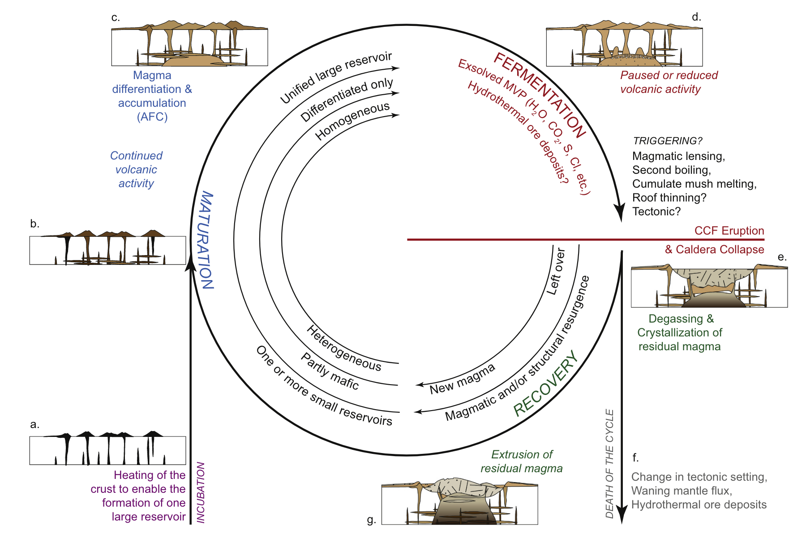
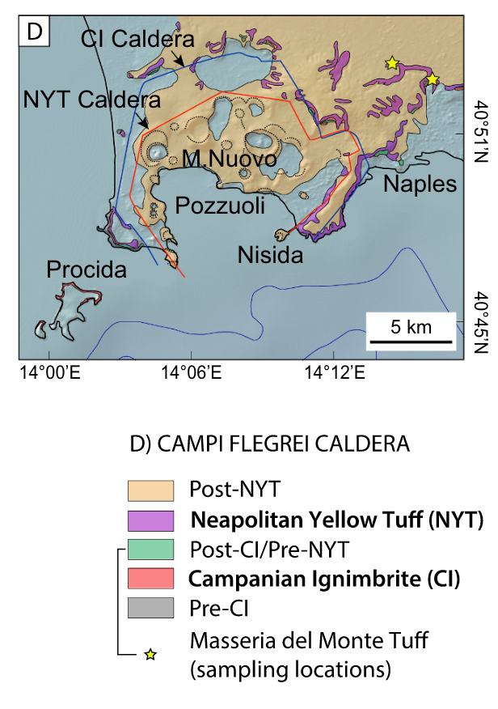
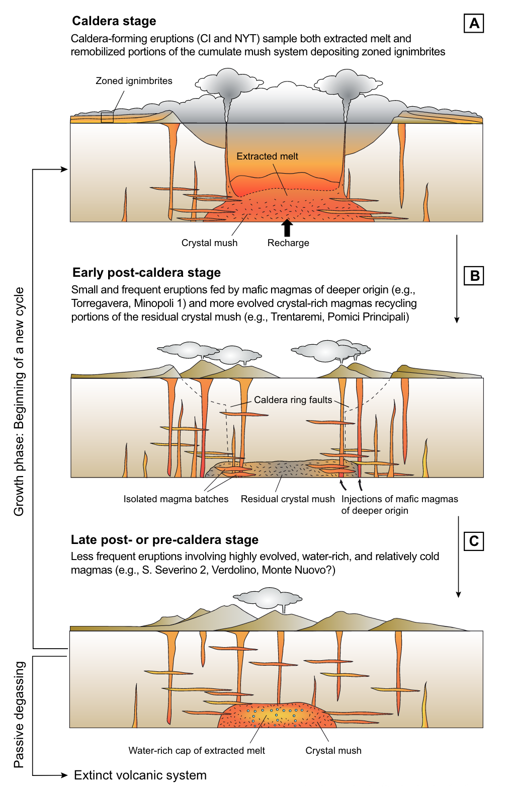
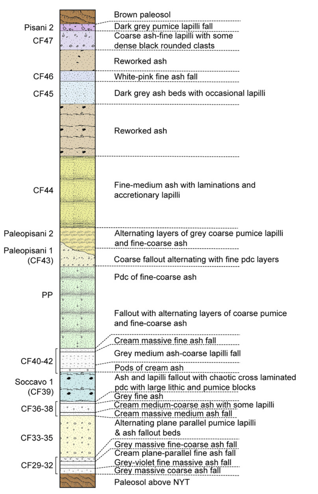

```{python}
import numpy as np
import seaborn as sns
sns.set_context('talk')
import matplotlib.pyplot as plt
plt.rcParams.update({
    "figure.facecolor":  (0.0, 0.0, 0.0, 0.0),  # red   with alpha = 30%
})
# Set colors for plotting
blue = '#2F4647'
orange = '#EB811B'
```


## Today's objectives

- **Last week**: We learned how to handle data using `Pandas`
  - Load, access, query, filter, sort and operate on data

::: {.fragment}
- **This week:** You received / compiled / produced a new dataset
- Review common tasks / method to get accustomed to the dataset
  - Understand its **structure** → what [type of data]{.bg} does it contain
  - Explore it **visually** → [plotting]{.bg} with dedicated libraries
  - Describe **single variables** → [univariate]{.bg} analyses
  - Assess coupled behaviours of **two variables** → [bivariate]{.bg} analyses
  - First attempt at **modelling** these behaviours → [linear regressions]{.bg}
:::


# The dataset {background-color="#2F4647"}

## Case study 

- **Campi Flegrei**: Home to 1.5 million people
- **Caldera-forming** eruptions
  - Campanian Ignimbrite (CI), ~39 ka ago
  - Neapolitan Yellow Tuff (NYT), ~15 ka ago


## Caldera-forming eruptions cycles




## Caldera cycles at Campi Flegrei


:::: {.columns}
::: {.column width="48%"}

{width="75%"}

:::

::: {.column width="4%"}
:::

::: {.column width="48%"}
{.img-up-50  width="75%"}
:::
::::


## Dataset

:::: {.columns}
::: {.column width="48%"}

**Tephrostratigraphy and glass compositions of post-15 kyr Campi Flegrei eruptions**

- Smith et al. (2011)
- Major and trace elements

:::

::: {.column width="4%"}
:::

::: {.column width="48%"}
{.img-up-50  width="75%"}
:::
::::


## Loading the dataset

- Import `pandas`
- Load an **excel** file using `pandas`
- Specify **which sheet** to read from using the `sheet_name` argument
  - *Supp_majors* → `df_majors`
  - *Supp_traces* → `df_traces`


<span style="font-size: 0.5em;"></span>

```{python}
#| echo: true

# Load Pandas
import pandas as pd # Import pandas

# Import the dataset specifying which Excel sheet name to load the data from
df_majors = pd.read_excel('https://raw.githubusercontent.com/ELSTE-Master/Data-Science/main/Data/Smith_glass_post_NYT_data_majors.csv')
df_traces = pd.read_excel('https://raw.githubusercontent.com/ELSTE-Master/Data-Science/main/Data/Smith_glass_post_NYT_data_traces.csv')
```


## Inspecting the dataset

:::: {.columns}
::: {.column width="48%"}

```{python}
#| echo: true
df_traces.head(5)
```

:::

::: {.column width="4%"}
:::

::: {.column width="48%"}
```{python}
#| echo: true
df_traces.info()
```
:::
::::

## Types of data

**Basic types of data**

- `int`: **Integer** numbers → 0, 1, 2, ...
- `float`: **Decimal** numbers → 1.1, 1.2, 1.3, ...
- `object`: **Strings** → "Campi Flegrei"

::: {.fragment}
**A note on *Bytes***

- `int` and `float` numbers are followed by 8, 16, 32 or 64 → **Byte** → control how much memory a variable uses
- A **Bit** is a binary digit → 0/1 → smallest possible unit of data
- `int8` can store $2^8$ digits = 256
- `int16` can store $2^16$ digits = 65'563

:::

## Families of data

<span style="font-size: 0.5em;"></span>

:::: {.columns}
::: {.column width="48%"}

### Numerical data### 

---

- Represent [quantities or measurable values]{.bg}
- **Quantitative**
  - *Discrete*: Earthquake counts
  - *Continuous*: Temperature
- Stored as **numerical** values
- **Operations** → arithmetic

:::

::: {.column width="4%"}
:::

::: {.column width="48%"}
::: {.fragment}


### Categorical data

---

- Represent [categories or groups]{.bg} of data
- **Qualitative** / semi-quantitative
  - *Nominal*: No order → Landslide type
  - *Ordinal*: Order → rank
- Stored as **strings** or **integer**
- **Operations** → counting, grouping
  
:::
:::
::::


## Families of data - cheat sheet


| **Feature** | **Categorical Data** | **Numerical Data** |
|--------------|----------------------|--------------------|
| **Definition** | **Categories or groups** of data |  **Quantities or measurable values** |
| **Nature** | Qualitative (describes qualities) | Quantitative (describes amounts or measurements) |
| **Data Type** | Non-numeric (often text or labels) | Numeric (numbers only) |
| **Examples** | Eruption type | Element concentration |
| **Possible Operations** | Counting, grouping, mode | Arithmetic operations |
| **Measurement Scale** | Nominal or Ordinal | Interval or Ratio |
| **Visualization Tools** | Bar chart, Pie chart | Histogram, Box plot, Scatter plot |
| **Subtypes** | **Nominal:** Categories with no order (e.g., color); **Ordinal:** Categories with order (e.g., rank) | **Discrete:** Countable numbers (e.g., number of earthquakes); **Continuous:** Measurable values (e.g., temperature) |
| **Examples of Statistical Summary** | Frequency, mode | Mean, median, standard deviation |
| **Storage Format** | Strings or labels | Integers or floats |


# Plotting data {background-color="#2F4647"}

## Plotting libraries

There are two main plotting libraries:

- `matplotlib` (and its module `pyplot`): core of plotting in Python
  - [Matplotlib gallery](https://matplotlib.org/stable/gallery/index.html)
- `seaborn`: based on `matplotlib`, designed for statistical exploration, integration with `pandas`
  - [Seaborn gallery](https://seaborn.pydata.org/examples/index.html)

<span style="font-size: 0.5em;"></span>

```{python}
#| echo: true
#| eval: false
import matplotlib.pyplot as plt # Import the pyplot module from matplotlib
import seaborn as sns # Import seaborn

```


## Anatomy of a figure

:::: {.columns}
::: {.column width="40%"}

- Setup figure: `plt.subplots()`
- Returns:
  - `fig` → figure
  - `ax` → axes

<span style="font-size: 0.5em;"></span>

```{python}
#| eval: false
#| echo: true
fig, ax = plt.subplots()
```
:::
::: {.column width="4%"}
:::
::: {.column width="56%"}
{}
:::
::::

## Anatomy of a axes

:::: {.columns}
::: {.column width="40%"}

**Axes:** Where most of the magic occurs

<span style="font-size: 0.5em;"></span>


| Function                                                                                          | Description                   |
|---------------------------------------------------------------------------------------------------|-------------------------------|
| [`ax.set_title`](https://matplotlib.org/stable/api/_as_gen/matplotlib.axes.Axes.set_title.html)   | Sets the title of the axes    |
| [`ax.set_xlabel`](https://matplotlib.org/stable/api/_as_gen/matplotlib.axes.Axes.set_xlabel.html) | Sets the label for the x-axis |
| [`ax.set_ylabel`](https://matplotlib.org/stable/api/_as_gen/matplotlib.axes.Axes.set_ylabel.html) | Sets the label for the y-axis |
| [`ax.legend`](https://matplotlib.org/stable/api/_as_gen/matplotlib.axes.Axes.legend.html)         | Displays the legend           |
| [`ax.grid`](https://matplotlib.org/stable/api/_as_gen/matplotlib.axes.Axes.grid.html)             | Shows grid lines              |

: {.striped   }


:::
::: {.column width="4%"}
:::
::: {.column width="56%"}
{}
:::
::::


## Plotting example {auto-animate="true"}

<span style="font-size: 0.5em;"></span>


```{python}

#| echo: true
#| eval: true
#| output-location: column-fragment

# Define some data
data1 = [1, 2, 3, 4, 5, 6, 7, 8, 9, 10]
data2 = [7, 3, 9, 1, 5, 10, 8, 2, 6, 4]

# Set the figure and the axes
fig, ax = plt.subplots()

# Plot the data
ax.plot(data1, data1, color='aqua', label='Line')
ax.scatter(data1, data2, color='purple', label='scatter')

```


## Plotting example {auto-animate="true"}

<span style="font-size: 0.5em;"></span>

```{python}

#| echo: true
#| eval: true
#| output-location: column-fragment

# Define some data
data1 = [1, 2, 3, 4, 5, 6, 7, 8, 9, 10]
data2 = [7, 3, 9, 1, 5, 10, 8, 2, 6, 4]

# Set the figure and the axes
fig, ax = plt.subplots()

# Plot the data
ax.plot(data1, data1, color='aqua', label='Line')
ax.scatter(data1, data2, color='purple', label='scatter')

# Set labels
ax.set_xlabel('x Label')
ax.set_ylabel('y Label')

# Only to make it look pretty on the presentation
plt.show()
```


## Seaborn

**Why Seaborn?**

<span style="font-size: 0.5em;"></span>

> Seaborn provides a high-level interface for drawing attractive and informative statistical graphics.

- Makes plotting `pandas` DataFrames **easy** 
- Produces **clean** graphics
- Drawback: difficult customisation


## Seaborn example {auto-animate="true"}

<span style="font-size: 0.5em;"></span>

```{python}

#| echo: true
#| eval: true

# Define figure + axes
fig, ax = plt.subplots()
# Plot with seaborn (remember, we imported it as sns)
# df_traces is the geochemical dataset imported previously
sns.scatterplot(ax=ax, data=df_traces, x='Rb', y='Sr')
```

## Seaborn example {auto-animate="true"}

<span style="font-size: 0.5em;"></span>

```{python}

#| echo: true
#| eval: true


# Define figure + axes
fig, ax = plt.subplots()
# Plot with seaborn (remember, we imported it as sns)
# df_traces is the geochemical dataset imported previously
sns.scatterplot(ax=ax, data=df_traces, x='Rb', y='Sr', hue='Epoch', size="SiO2* (EMP)")
```


## Your turn!

- Go to [https://elste-master.github.io/Data-Science/](https://elste-master.github.io/Data-Science/)
  - Class 2 > [Data exploration]{.bg}
  - Explore the structure of the glass geochemistry or [your]{.bg} dataset
  - Get used to plotting functions


<iframe src="../class2/day2-2_data_exploration.html" width="100%" height="400px" style="border:none;"></iframe>


# Descriptive statistics {background-color="#2F4647"}

## Descriptive statistics

<span style="font-size: 0.5em;">&nbsp;</span>

- **Descriptive statistics** → [provide ways of capturing the properties of a given data set or sample]{.bg}. 
- `Pandas` and `Seaborn` → review [metrics, tools, and strategies]{.bg} to summarize a dataset
- Providing us with a [quantitative basis]{.bg} to describe it and compare it to other datasets

# Univariate analyses {background-color="#2F4647"}

## Univariate analyses {auto-animate="true"}

- **Objective** [capturing the properties of **single** variables at the time]{.bg}
- Fist step: review the samples distribution using **histograms**
  - Divides dataset into **equal intervals** → [bins]{.bg}
  - **Counts the value** in each bin
  - Represents the [distribution]{.bg} of data


```{python}
#| echo: false
#| eval: true

data = np.random.normal(size=1000)
fig, ax = plt.subplots(figsize=(12,5))
sns.histplot(data=data, color=blue, alpha=.5, label='Sample')
# Compute normal pdf (using sample mean/std) and scale it to the histogram area, then plot it
mu, sigma = data.mean(), data.std()
x = np.linspace(-4,4, 300)
pdf = (1 / (sigma * np.sqrt(2 * np.pi))) * np.exp(-0.5 * ((x - mu) / sigma) ** 2)

# Scale pdf to histogram total area so the line matches the bar heights
hist_area = sum([p.get_height() * p.get_width() for p in ax.patches])
pdf_scaled = pdf * hist_area

ax.plot(x, pdf_scaled, color='orange', lw=2, label=f'Theoretical distribution')
ax.legend(frameon=False)
```


## Univariate analyses {auto-animate="true"}

- **Objective** [capturing the properties of **single** variables at the time]{.bg}
- Fist step: review the samples distribution using **histograms**
  - Divides dataset into **equal intervals** → [bins]{.bg}
  - **Counts the value** in each bin
  - Represents the [distribution]{.bg} of data

:::: {.columns}
::: {.column width="48%"}
<span style="font-size: 0.5em;">&nbsp;</span>
Automatic number of bins:
```{python}
#| echo: true
#| eval: false

fig, ax = plt.subplots()
# Plot histogram
sns.histplot(data=df_traces, x='Zr', color=blue, alpha=.5)
ax.set_xlabel('Zr (ppm)');
ax.set_title('Zr distribution');
```
:::
::: {.column width="4%"}
:::
::: {.column width="48%"}
```{python}
#| echo: false
#| eval: true

fig, ax = plt.subplots()
# Plot histogram
sns.histplot(data=df_traces, x='Zr', color=blue, alpha=.5)
ax.set_xlabel('Zr (ppm)');
ax.set_title('Zr distribution');
```
:::
::::


## Univariate analyses {auto-animate="true"}

- **Objective** [capturing the properties of **single** variables at the time]{.bg}
- Fist step: review the samples distribution using **histograms**
  - Divides dataset into **equal intervals** → [bins]{.bg}
  - **Counts the value** in each bin
  - Represents the [distribution]{.bg} of data

:::: {.columns}
::: {.column width="48%"}
<span style="font-size: 0.5em;">&nbsp;</span>
10 bins:
```{python}
#| echo: true
#| eval: false

fig, ax = plt.subplots()
# Plot histogram
sns.histplot(data=df_traces, x='Zr', bins=10, color=blue, alpha=.5)
ax.set_xlabel('Zr (ppm)');
ax.set_title('Zr distribution');
```

:::
::: {.column width="4%"}
:::
::: {.column width="48%"}

```{python}
#| echo: false
#| eval: true

fig, ax = plt.subplots()
# Plot histogram
sns.histplot(data=df_traces, x='Zr', bins=10, color=blue, alpha=.5)
ax.set_xlabel('Zr (ppm)');
ax.set_title('Zr distribution');
```
:::
::::


## Univariate analyses {auto-animate="true"}

- **Objective** [capturing the properties of **single** variables at the time]{.bg}
- Fist step: review the samples distribution using **histograms**
  - Divides dataset into **equal intervals** → [bins]{.bg}
  - **Counts the value** in each bin
  - Represents the [distribution]{.bg} of data

:::: {.columns}
::: {.column width="48%"}
<span style="font-size: 0.5em;">&nbsp;</span>
200 bins:
```{python}
#| echo: true
#| eval: false

fig, ax = plt.subplots()
# Plot histogram
sns.histplot(data=df_traces, x='Zr', bins=200, color=blue, alpha=.5)
ax.set_xlabel('Zr (ppm)');
ax.set_title('Zr distribution');
```
:::
::: {.column width="4%"}
:::
::: {.column width="48%"}
```{python}
#| echo: false
#| eval: true

fig, ax = plt.subplots()
# Plot histogram
sns.histplot(data=df_traces, x='Zr', bins=200, color=blue, alpha=.5)
ax.set_xlabel('Zr (ppm)');
ax.set_title('Zr distribution');
```
:::
::::


## Descriptive parameters

Intuitive importance of describing **three different characteristics** of the distribution:


:::: {.columns}
::: {.column width="48%"}
- The **location** - or where is [the central value(s)]{.bg} of the dataset;
- The **dispersion** - or how [spread out]{.bg} is the distribution of data compared to the central values;
- The **skewness** - or how [symmetrical]{.bg} is the distribution of data compared to the central values;

:::
::: {.column width="4%"}
:::
::: {.column width="48%"}
```{python}
#| echo: false
#| eval: true

fig, ax = plt.subplots()
# Plot histogram
sns.histplot(data=df_traces, x='Zr', color=blue, alpha=.5)
ax.set_xlabel('Zr (ppm)');
ax.set_title('Zr distribution');
```
:::
::::


## Descriptive parameters

<span style="font-size: 0.5em;"></span>

- **Ideally** → able to constrain [full distributions]{.bg} of $X$
  - **theoretical moments**
- **In practice** → only observe a finite [sample]{.bg} of $X$ 
  - **estimators**


```{python}
#| echo: false
#| eval: true

data = np.random.normal(size=1000)
fig, ax = plt.subplots(figsize=(12,5))
sns.histplot(data=data, color=blue, alpha=.5, label='Sample')
# Compute normal pdf (using sample mean/std) and scale it to the histogram area, then plot it
mu, sigma = data.mean(), data.std()
x = np.linspace(-4,4, 300)
pdf = (1 / (sigma * np.sqrt(2 * np.pi))) * np.exp(-0.5 * ((x - mu) / sigma) ** 2)

# Scale pdf to histogram total area so the line matches the bar heights
hist_area = sum([p.get_height() * p.get_width() for p in ax.patches])
pdf_scaled = pdf * hist_area

ax.plot(x, pdf_scaled, color='orange', lw=2, label=f'Theoretical distribution')
ax.legend(frameon=False)
```


## Location I: Mean

The **mean** is the [sum of the values divided by the number of values]{.bg}:

$$
\bar{x} = \frac{1}{n} \sum_{i=1}^{n} x_i
$$ 

- Meaningful to describe [symmetrical distributions]{.bg}
- Very **sensitive** to [outliers]{.bg}
- `df.mean()`

<span style="font-size: 0.5em;"></span>

::: {.fragment}
```{python}

#| echo: true
#| eval: true
#| output-location: column

# One column
df_traces[['Zr']].mean().round(2)
# Multiple columns
df_traces[['Zr','Rb','Sr']].mean().round(2)

```
:::


## Location II: Median

The **median** is the value [at the exact middle of the dataset]{.bg}.

:::: {.columns}
::: {.column width="48%"}

- No equation, use of ECDF
- `df.median()`

```{python}
#| echo: false
#| eval: true

fig, ax = plt.subplots(figsize=(6,4))
sns.ecdfplot(data=df_traces, x='Zr', color=blue)
ax.plot([0, df_traces['Zr'].median()], [.5,.5], color=orange)
ax.plot([df_traces['Zr'].median(), df_traces['Zr'].median()], [.5,0], color=orange)
ax.set_xlim([0,900])
ax.set_ylim([0,1])
```
:::
::: {.column width="4%"}
:::
::: {.column width="48%"}

<span style="font-size: 0.5em;">&nbsp;</span>

```{python}

#| echo: true
#| eval: true

# One column
df_traces[['Zr']].median().round(2)
# Multiple columns
df_traces[['Zr','Rb','Sr']].median().round(2)
```

:::
::::

## Location III: Mode

The **mode** is the value [that occur most frequently in a dataset]{.bg}.

- **Categorical** or **discrete numerical data**: value(s) that appear most often.
- For **continuous data**, exact duplicates may be rare

```{python}
#| echo: true
#| eval: true
#| output-location: column

# Calculate the modes
modes = df_traces['Zr'].mode().round(2)

# Plot the histogram
fig, ax = plt.subplots()
sns.histplot(data=df_traces, x='Zr', ax=ax, color=blue, alpha=.5)

# Plot the modes
[ax.axvline(m, color='darkorange', lw=2) for i, m in enumerate(modes)]

ax.set_xlabel('Zr (ppm)')
plt.show()

```

## Location: Summary

:::: {.columns}
::: {.column width="48%"}
- **Mean**: Best for symmetric distributions
  - Sensitive to outliers
- **Median**: Best for skewed or outlier-prone data
  - Only based on rank, not magnitude
- **Mode**: Best for describing the most frequent range in grouped or categorical-like data.
  - Otherwise requires binning
  
:::
::: {.column width="4%"}
:::
::: {.column width="48%"}

```{python}
#| echo: false
#| eval: true
#| output-location: column


# Set the histogram's bin width
binwidth = 50

# Make the bin range
minVal = int(df_traces['Zr'].min()) # Minimum value of the dataset, convert it to an integer
maxVal = int(df_traces['Zr'].max()) # Maximum value of the dataset, convert it to an integer
binsVal = range(minVal, maxVal, binwidth)
binned = pd.cut(df_traces['Zr'], bins=binsVal)
modes = binned.mode();


# Convert modes to numeric positions (handles numeric modes and Interval modes from pd.cut)
numeric_modes = []
for m in modes:
    numeric_modes.append((m.left + m.right) / 2)  # midpoint of the interval


fig, ax = plt.subplots()
sns.histplot(data=df_traces, x='Zr', binwidth=binwidth, color=blue, alpha=.5)
ax.axvline(df_traces['Zr'].mean(), color='darkorange', lw=3, label='Mean')
ax.axvline(df_traces['Zr'].median(), color='darkorange', ls=':', lw=3, label='Median')
ax.axvline(numeric_modes, color='darkorange', lw=3, ls='--', label='Binned mode')
ax.legend(frameon=False)
```

:::
::::


## Dispersion 1: Range

The **range** is the range of value covered in the dataset


:::: {.columns}
::: {.column width="48%"}
- Min → `df.min()`
- Max → `df.max()`
- Range:

$$
\text{Range} = \max(x) - \min(x)
$$ 

:::
::: {.column width="4%"}
:::
::: {.column width="48%"}

<span style="font-size: 0.5em;">&nbsp;</span>

```{python}
#| echo: true
#| eval: true

df_min = df_traces['Zr'].min()
df_max = df_traces['Zr'].max()
df_range = df_max - df_min
print(f"The range of Zircon concentrations is {df_range:.2f}")
```
:::
::::

::: {.fragment }
::: {.callout-warning}
## Don't use Python reserved keywords as variable names
Names as `min`, `max` or `range` represent native Python variables and **cannot be used as variable names!**
:::
:::

## Dispersion 2: Standard deviation {auto-animate="true"}


The **sample standard deviation** ($s$) is the sum of squares differences between data points $x_i$ and the
mean $\bar{x}$ over $n$ observations:
$$
s = \sqrt{\frac{\sum_{i=1}^{n} (x_i - \bar{x})^2}{n-1} }
$$

<span style="font-size: 0.5em;"></span>

:::: {.columns}
::: {.column width="48%"}

- $s$ is in [the same unit as the data]{.bg}
  - Easy to interpret
- `df.std()`

:::
::: {.column width="4%"}
:::
::: {.column width="48%"}

<span style="font-size: 0.5em;"></span>

```{python}
#| echo: true
#| eval: true

df_traces['Zr'].std()

```
:::
::::


## Dispersion 2: Standard deviation {auto-animate="true"}

The **theoretical standard deviation** ($\sigma$) is closely related to the **normal distribution** as:

:::: {.columns}
::: {.column width="48%"}


- $1\sigma$ → ~68% of the data
- $2\sigma$ → ~95% of the data
- $3\sigma$ → ~99.7% of the data

:::
::: {.column width="4%"}
:::
::: {.column width="48%"}

```{python}
#| echo: false
#| eval: true


# Generate 1000 random numbers from a normal distribution
data = np.random.normal(loc=0, scale=1, size=1000)

# Compute mean and standard deviation
mean = np.mean(data)
std = np.std(data)

# Create the histogram
plt.figure()
sns.histplot(data, color=blue, alpha=.5)

clr = ['', '#5F4690','#1D6996','#38A6A5']
# Add vertical lines for mean and ±1σ, ±2σ, ±3σ
for i in range(1, 4):
    plt.axvline(mean + i * std, color=clr[i], linestyle="--", label=f"-{i}σ/+{i}σ")
    plt.axvline(mean - i * std, color=clr[i], linestyle="--")

# Add a line for the mean
plt.axvline(mean, color=orange, linestyle="-", linewidth=2, label="Mean")

# Labeling
plt.xlabel("Value")
plt.ylabel("Frequency")
plt.legend()

# Show the plot
plt.show()


```
:::
::::


## Dispersion 2.1: Variance


The **variance** ($s^2$) is the [average of squared deviations]{.bg} from the mean (→ the square of the standard deviation):
$$
s^2 = \frac{\sum_{i=1}^{n} (x_i - \bar{x})^2}{n-1} 
$$

<span style="font-size: 0.5em;"></span>

:::: {.columns}
::: {.column width="54%"}

- $s^2$ is in **not** the same unit as the data
- Used in modelling (e.g., ANOVA)
- `df.var()`

:::
::: {.column width="46%"}

<span style="font-size: 0.5em;"></span>

```{python}
#| echo: true
#| eval: true

df_traces['Zr'].var()

```
:::
::::

::: {.callout-tip}
## Rule of thumb

- Comparing data spread → [standard deviation]{.bg}
- Statistical modelling → [variance]{.bg}

:::


## Dispersion 3: Interquartile range


The **interquartile range** (IQR) indicates [how spread out the middle 50%]{.bg} of the data is.

- Difference between the third quartile (Q3) and the first quartile (Q1):

$$
\mathrm{IQR} = Q_3 - Q_1
$$ {#eq-IQR}

- Q1: The value below which **25% of the data fall**
- Q3: The value below which **75% of the data fall**


## Dispersion 3: Interquartile range

<span style="font-size: 0.5em;">&nbsp;</span>

| **Measure**                | **Number of Divisions** | **Position(s) in Data / Percentile Equivalent**                           |
| -------------------------- | ----------------------- | ------------------------------------------------------------------------- |
| **Quartiles (Q1, Q2, Q3)** | 4 equal parts           | Q1 = 25th percentile, Q2 = 50th percentile (median), Q3 = 75th percentile |
| **Deciles (D1 … D9)**      | 10 equal parts          | D1 = 10th percentile, D2 = 20th percentile, …, D9 = 90th percentile       |
| **Percentiles (P1 … P99)** | 100 equal parts         | P1 = 1st percentile, P2 = 2nd percentile, …, P99 = 99th percentile        |
: Relationship between quartiles, deciles and percentiles. {#tbl-univ-pct .striped}

- [median]{.bg} = 
  - 2nd quartile = Q2
  - 5th decile = D5
  - 50th percentile = P50


## Dispersion 3: Interquartile range


The **interquartile range** (IQR) indicates [how spread out the middle 50%]{.bg} of the data is.


:::: {.columns}
::: {.column width="48%"}

<span style="font-size: 0.5em;"></span>

$Q_1$ and $Q_3$ for a **symmetrical** distribution:


:::
::: {.column width="4%"}
:::
::: {.column width="48%"}

<span style="font-size: 0.5em;"></span>

$Q_1$ and $Q_3$ for an **asymmetrical** distribution:


:::
::::


## Shape: Skewness


The **skewness** measures [the asymmetry of a distribution]{.bg} and is computed as:

$$
\text{Skewness} = \frac{1}{n} \sum_{i=1}^{n}\left(\frac{x_i-\bar{x}}{s}\right)^{3}
$$ 

In *Pandas*, the skewness can be computed using `.skew()`

- **0**: [Symmetric]{.bg} → e.g., normal distribution
- **>0**: [Righ-skewed]{.bg} → a tail extends to the right
- **<0**: [Left-skewed]{.bg} → a tail extends to the left


## Distribution visualisation

Beyond **histograms** → some plot types report [empirical]{.bg} indications of **location**, **dispersion** and **skewness**.

**Box and whisker plots**

:::: {.columns}
::: {.column width="40%"}

- **Box** → $IQR$ + median
- **Whiskers**  1.5 times the IQR from Q1/Q3
- **Outlier** → differs from the majority of observations

:::

::: {.column width="60%"}

{.img-up-50}

:::
::::


## Distribution visualisation: Box plots

<span style="font-size: 0.5em;">&nbsp;</span>

:::: {.columns}
::: {.column width="48%"}

- `sns.boxplot()`
- No density
- No tail resolution

:::
::: {.column width="4%"}
:::
::: {.column width="48%"}

```{python}
#| echo: true
#| eval: true

fig, ax = plt.subplots()
sns.boxplot(data=df_traces[['Zr', 'Sr']], orient="h", ax=ax)
ax.set_xlabel('Concentration (ppm)');
ax.set_title('Zr and Sr distribution');
```
:::
::::


## Distribution visualisation: Violin plots

<span style="font-size: 0.5em;">&nbsp;</span>

:::: {.columns}
::: {.column width="48%"}

- `sns.violinplot()`
- Density estimate through Kernel Density Estimator → [artefacts]{.bg}
- Some tail resolution, not always realistic

:::
::: {.column width="4%"}
:::
::: {.column width="48%"}

```{python}
#| echo: true
#| eval: true

fig, ax = plt.subplots()
sns.violinplot(data=df_traces[['Zr', 'Sr']], orient="h", ax=ax)
ax.set_xlabel('Concentration (ppm)');
ax.set_title('Zr and Sr distribution');
```
:::
::::

## Distribution visualisation: Boxen plots

<span style="font-size: 0.5em;">&nbsp;</span>

:::: {.columns}
::: {.column width="48%"}

- `sns.boxenplot()`
- Plots deciles → some density estimate
- Good tail resolution

:::
::: {.column width="4%"}
:::
::: {.column width="48%"}

```{python}
#| echo: true
#| eval: true

fig, ax = plt.subplots()
sns.boxenplot(data=df_traces[['Zr', 'Sr']], orient="h", ax=ax)
ax.set_xlabel('Concentration (ppm)');
ax.set_title('Zr and Sr distribution');
```
:::
::::


## Your turn!

- Go to [https://elste-master.github.io/Data-Science/](https://elste-master.github.io/Data-Science/)
  - Class 2 > [Univariate analyses]{.bg}
  - Explore the structure of the glass geochemistry or [your]{.bg} dataset
  - Get used to the various functions

<iframe src="../class2/day2-3_univariate.html" width="100%" height="400px" style="border:none;"></iframe>


# Bivariate analyses {background-color="#2F4647"}

## Pairwise comparison

:::: {.columns}
::: {.column width="40%"}

A first visual inspection using `sns.pairplot()`

- Numerical values
- One categorical value

:::
::: {.column width="4%"}
:::
::: {.column width="56%"}
```{python}
#| echo: false
#| eval: true

df_traces_sub = df_traces[['Epoch', 'U', 'Sc', 'Hf', 'Zr', 'Sr']]
sns.pairplot(data=df_traces_sub, hue='Epoch')
```

:::
::::


