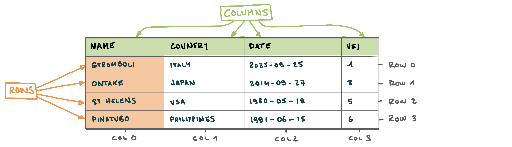
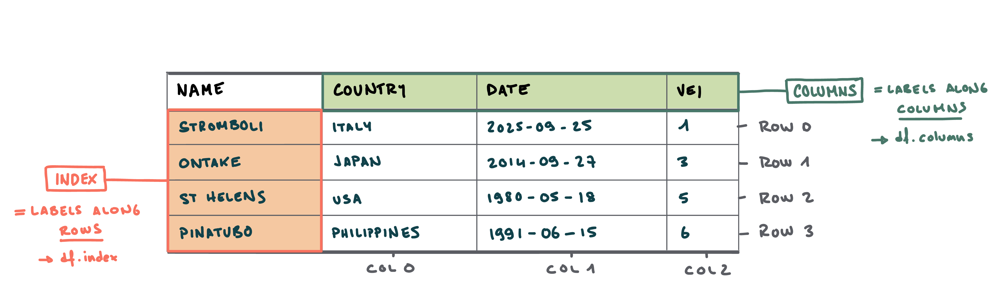
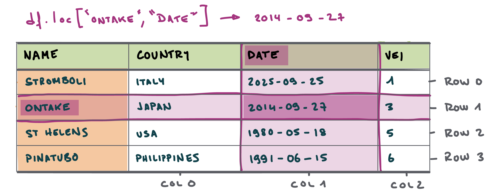
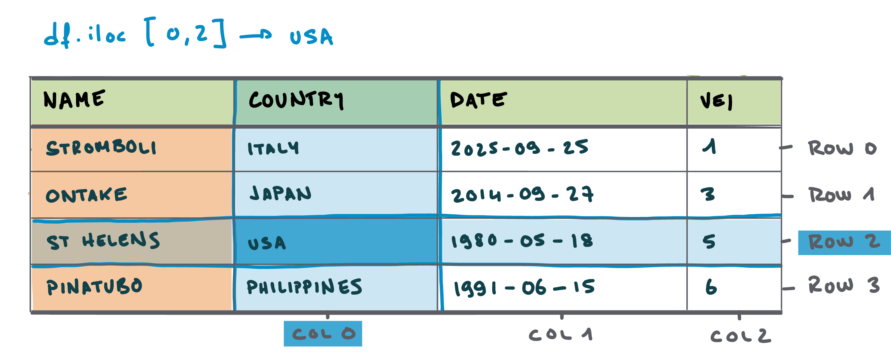

## Today's objectives

- **Last week**: We learned how to handle data using `Pandas`
  - Load, access, query, filter, sort and operate on data

::: {.fragment}
- **This week:** You received / compiled / produced a new dataset
- Review common tasks / method to get accustomed to the dataset
  - Understand its **structure** → what [type of data]{.bg} does it contain
  - Explore it **visually** → [plotting]{.bg} with dedicated libraries
  - Describe **single variables** → [univariate]{.bg} analyses
  - Assess coupled behaviours of **two variables** → [bivariate]{.bg} analyses
  - First attempt at **modelling** these behaviours → [linear regressions]{.bg}
:::


# The dataset {background-color="#2F4647"}

## Case study 

- **Campi Flegrei**: Home to 1.5 million people
- **Caldera-forming** eruptions
  - Campanian Ignimbrite (CI), ~39 ka ago
  - Neapolitan Yellow Tuff (NYT), ~15 ka ago


## Caldera-forming eruptions cycles


## Caldera cycles at Campi Flegrei


:::: {.columns}
::: {.column width="48%"}

{width="75%"}

:::

::: {.column width="4%"}
:::

::: {.column width="48%"}
{.img-up-50  width="75%"}
:::
::::


## Dataset

:::: {.columns}
::: {.column width="48%"}

**Tephrostratigraphy and glass compositions of post-15 kyr Campi Flegrei eruptions**

- Smith et al. (2011)
- Major and trace elements

:::

::: {.column width="4%"}
:::

::: {.column width="48%"}
{.img-up-50  width="75%"}
:::
::::


## Loading the dataset

- Import `pandas`
- Load an **excel** file using `pandas`
- Specify **which sheet** to read from using the `sheet_name` argument
  - *Supp_majors* → `df_majors`
  - *Supp_traces* → `df_traces`


<span style="font-size: 0.5em;"></span>

```{python}
#| echo: true

# Load Pandas
import pandas as pd # Import pandas

# Import the dataset specifying which Excel sheet name to load the data from
df_majors = pd.read_excel('https://github.com/ELSTE-Master/Data-Science/raw/refs/heads/main/Data/Smith_glass_post_NYT_data.xlsx', sheet_name='Supp_majors')
df_traces = pd.read_excel('https://github.com/ELSTE-Master/Data-Science/raw/refs/heads/main/Data/Smith_glass_post_NYT_data.xlsx', sheet_name='Supp_traces')
```


## Inspecting the dataset

:::: {.columns}
::: {.column width="48%"}

```{python}
#| echo: true
df_traces.head(5)
```

:::

::: {.column width="4%"}
:::

::: {.column width="48%"}
```{python}
#| echo: true
df_traces.info()
```
:::
::::

## Types of data

**Basic types of data**

- `int`: **Integer** numbers → 0, 1, 2, ...
- `float`: **Decimal** numbers → 1.1, 1.2, 1.3, ...
- `object`: **Strings** → "Campi Flegrei"

::: {.fragment}
**A note on *Bytes***

- `int` and `float` numbers are followed by 8, 16, 32 or 64 → **Byte** → control how much memory a variable uses
- A **Bit** is a binary digit → 0/1 → smallest possible unit of data
- `int8` can store $2^8$ digits = 256
- `int16` can store $2^16$ digits = 65'563

:::

## Families of data

<span style="font-size: 0.5em;"></span>

:::: {.columns}
::: {.column width="48%"}

### Numerical data### 

---

- Represent [quantities or measurable values]{.bg}
- **Quantitative**
  - *Discrete*: Earthquake counts
  - *Continuous*: Temperature
- Stored as **numerical** values
- **Operations** → arithmetic

:::

::: {.column width="4%"}
:::

::: {.column width="48%"}
::: {.fragment}


### Categorical data

---

- Represent [categories or groups]{.bg} of data
- **Qualitative** / semi-quantitative
  - *Nominal*: No order → Landslide type
  - *Ordinal*: Order → rank
- Stored as **strings** or **integer**
- **Operations** → counting, grouping
  
:::
:::
::::


## Families of data - cheat sheet


| **Feature** | **Categorical Data** | **Numerical Data** |
|--------------|----------------------|--------------------|
| **Definition** | **Categories or groups** of data |  **Quantities or measurable values** |
| **Nature** | Qualitative (describes qualities) | Quantitative (describes amounts or measurements) |
| **Data Type** | Non-numeric (often text or labels) | Numeric (numbers only) |
| **Examples** | Eruption type | Element concentration |
| **Possible Operations** | Counting, grouping, mode | Arithmetic operations |
| **Measurement Scale** | Nominal or Ordinal | Interval or Ratio |
| **Visualization Tools** | Bar chart, Pie chart | Histogram, Box plot, Scatter plot |
| **Subtypes** | **Nominal:** Categories with no order (e.g., color); **Ordinal:** Categories with order (e.g., rank) | **Discrete:** Countable numbers (e.g., number of earthquakes); **Continuous:** Measurable values (e.g., temperature) |
| **Examples of Statistical Summary** | Frequency, mode | Mean, median, standard deviation |
| **Storage Format** | Strings or labels | Integers or floats |


# Plotting data {background-color="#2F4647"}


<!-- 


## Anatomy of a DataFrame



::: {.fragment}
- Similar to *Excel* → contains *tabular data* composed of [rows]{.bg} and [columns]{.bg}
:::

::: {.fragment}
- In *Excel*:
  - **Rows** are accessed using *numbers*
  - **Columns** are accessed using *letters*
:::

## Anatomy of a DataFrame



::: {.fragment}
- Unlike *Excel*, **rows** and **columns** can be [labelled]{.bg}
  - [Index]{.bg} refers to the label of the **rows**. In the *index*, **values are usually unique** - meaning that each entry has a different label.
  - [Column]{.bg} refers to the label of - logically - the **columns**
:::

# Data structure {background-color="#2F4647"}

## The dataset

Synthetic dataset of **selected volcanic eruptions** → first 5 rows:

<span style="font-size: 0.5em;"></span>

| Name            | Country     | Date                |   VEI |   Latitude |   Longitude |
|:----------------|:------------|:--------------------|------:|-----------:|------------:|
| St. Helens      | USA         | 1980-05-18 |     5 |    46.1914 |   -122.196  |
| Pinatubo        | Philippines | 1991-04-02 |     6 |    15.1501 |    120.347  |
| El Chichón      | Mexico      | 1982-03-28 |     5 |    17.3559 |    -93.2233 |
| Galunggung      | Indonesia   | 1982-04-05 |     4 |    -7.2567 |    108.077  |
| Nevado del Ruiz | Colombia    | 1985-11-13 |     3 |     4.895  |    -75.322  |
: {.table .table-striped .table-hover}

## Volcanic explosivity index (VEI)


## Setting up the notebook {auto-animate="true"}

- We start by importing the `pandas` library
- We import it under the name [pd]{.bg} - which is faster to type!

<span style="font-size: 0.5em;"></span>

```{python}
# | eval: False 
# | echo: True 

# Import the required packages
import pandas as pd
```

## Setting up the notebook {auto-animate="true"}

- We then load the specified data with the `pd.read_csv()` function
- This returns a [DataFrame]{.bg} object in a variable named `df`

<span style="font-size: 0.5em;"></span>

```{python}
# | eval: False 
# | echo: True

# Import the required packages
import pandas as pd

# Read the data
df = pd.read_csv('https://raw.githubusercontent.com/ELSTE-Master/Data-Science/main/Data/dummy_volcanoes.csv', parse_dates=['Date']) # Load data
```

## Setting up the notebook {auto-animate="true"}

- We print some data for inspection with `df.head()`
- The functions are now directly called from the [DataFrame]{.bg} `df` object 

<span style="font-size: 0.5em;"></span>


```{python}
# | eval: True 
# | echo: True

# Import the required packages
import pandas as pd

# Read the data
df = pd.read_csv('https://raw.githubusercontent.com/ELSTE-Master/Data-Science/main/Data/dummy_volcanoes.csv', parse_dates=['Date']) # Load data

# Show the first 3 rows
df.head(3) 
```

## Setting the index


## Setting the index

- ...for now, the index (**→ the first column)** is an *integer*
- This might be acceptable in datasets where the *label* is not important

<span style="font-size: 0.5em;"></span>

```{python}
# | eval: True 
# | echo: True

# Show the first 3 rows
df.head(3) 
```

## Setting the index

- Here we want to access the data using the **name of the volcano**
- We **set the index** using `set_index()`

<span style="font-size: 0.5em;"></span>

```{python}
# | eval: True 
# | echo: True

# Set the index to the 'Name' column
df = df.set_index('Name')

# Show the first 3 rows
df.head(3) 
```


## Exploring data

- Here are some **basic functions** to review the structure of the dataset:

<span style="font-size: 0.5em;"></span>


| Function     | Description                                                                                   |
|--------------|-----------------------------------------------------------------------------------------------|
| `df.head()`  | Prints the *first* 5 rows of the DataFrame.                                                   |
| `df.tail()`  | Prints the *last* 5 rows of the DataFrame.                                                    |
| `df.info()`  | Displays some info about the DataFrame, including the number of rows (*entries*) and columns. |
| `df.shape`   | Returns a list containing the number of rows and columns of the DataFrame.                    |
| `df.index`   | Returns a list containing the index along the *rows* of the DataFrame.                        |
| `df.columns` | Returns a list containing the index along the *columns* of the DataFrame.                     |

: {.striped}

<span style="font-size: 0.5em;"></span>

::: {.callout-tip}
## Functions vs attributes

- **Functions** have parentheses → they **compute** something on `df`
- **Attributes** do *not* have parentheses → they store some **parameter** related to `df`


:::


## Sorting data {auto-animate="true"}

- Sorting [numerical]{.bg}, [datetime]{.bg} or [strings]{.bg} using `.sort_values`
- Importance of [documentation](https://pandas.pydata.org/docs/reference/api/pandas.DataFrame.sort_values.html) to understand [arguments]{.bg}

```{python}
# | eval: True 
# | echo: True

df.sort_values('VEI').head() # Sort volcanoes by VEI in ascending number
```

## Sorting data {auto-animate="true"}

- Sorting [numerical]{.bg}, [datetime]{.bg} or [strings]{.bg} using `.sort_values`
- Importance of [documentation](https://pandas.pydata.org/docs/reference/api/pandas.DataFrame.sort_values.html) to understand [arguments]{.bg}

```{python}
# | eval: True 
# | echo: True

df.sort_values('VEI').head() # Sort volcanoes by VEI in ascending number
df.sort_values('Date', ascending=False).head() # Sort volcanoes by eruption dates from recent to old
```

## Sorting data {auto-animate="true"}

- Sorting [numerical]{.bg}, [datetime]{.bg} or [strings]{.bg} using `.sort_values`
- Importance of [documentation](https://pandas.pydata.org/docs/reference/api/pandas.DataFrame.sort_values.html) to understand [arguments]{.bg}

```{python}
# | eval: True 
# | echo: True

df.sort_values('VEI').head() # Sort volcanoes by VEI in ascending number
df.sort_values('Date', ascending=False).head() # Sort volcanoes by eruption dates from recent to old
df.sort_values('Country').head() # Also works on strings to sort alphabetically
```

## Sorting data {auto-animate="true"}

- Sorting [numerical]{.bg}, [datetime]{.bg} or [strings]{.bg} using `.sort_values`
- Importance of [documentation](https://pandas.pydata.org/docs/reference/api/pandas.DataFrame.sort_values.html) to understand [arguments]{.bg}

```{python}
# | eval: True 
# | echo: True

df.sort_values('VEI').head() # Sort volcanoes by VEI in ascending number
df.sort_values('Date', ascending=False).head() # Sort volcanoes by eruption dates from recent to old
df.sort_values('Country').head() # Also works on strings to sort alphabetically
df.sort_values(['Latitude', 'Longitude']).head() # Sorting using multiple columns
```


## Your turn!

- Go to [https://elste-master.github.io/Data-Science/](https://elste-master.github.io/Data-Science/)
  - Class 1 > [Data Structure]{.bg}

<span style="font-size: 0.5em;"></span>

<iframe src="../class1/day1-3_data_exploration.html" width="100%" height="400px" style="border:none;"></iframe>


# Querying data {background-color="#2F4647"}


## Accessing data in a DataFrame


## Accessing data in a DataFrame

**Option 1**: [label-based]{.bg} indexing

- Use the [labels]{.bg} of **index** and **columns** to retrieve data
- Function to use: `df.loc`

::: {.fragment}

:::


## Accessing data in a DataFrame

**Option 2**: [position-based]{.bg} indexing

- Use the [positions]{.bg} of **index** and **columns** to retrieve data
- Function to use: `df.iloc`

::: {.fragment}

:::

## Label-based indexing: Rows

- **Query a [row]{.bg}** with `.loc` → Use **square brackets** `[ ]`
  - Query the *row* for which the *index label* is `Calbuco`
  - Returns all *columns*

<span style="font-size: 0.5em;"></span>

:::: {.columns}
::: {.column width="48%"}
::: {.fragment}

```{python}
# | eval: True 
# | echo: True

df.loc['Calbuco']
```

→ Returns a [pd.Series]{.bg}
:::
:::

::: {.column width="4%"}
:::

::: {.column width="48%"}
::: {.fragment}
```{python}
# | eval: True 
# | echo: True

df.loc[['Calbuco']]
```

→ Returns a [pd.DataFrame]{.bg}

:::
:::
::::


## Label-based indexing: Rows

- **Query [multiple rows]{.bg}**  with `.loc`
  - Query the *rows* for which the *index labels* are `Calbuco` or `Taal`
  - Returns all *columns*

<span style="font-size: 0.5em;"></span>

::: {.fragment}
```{python}
# | eval: True 
# | echo: True

df.loc[['Calbuco', 'Taal']]
```
:::

## Label-based indexing: Columns

- **Query [columns]{.bg}** 
  - Query the *columns* for which the *column labels* are `Country` or `VEI`
  - Returns all *rows*

:::: {.columns}
::: {.column width="48%"}
::: {.fragment}

- **Option 1**: [with]{.bg} `.loc`:
```{python}
# | eval: True 
# | echo: True
df.loc[:, ['Country', 'VEI']].head(3)
```
:::

:::

::: {.column width="4%"}
:::

::: {.column width="48%"}
::: {.fragment}
- **Option 2**: [without]{.bg} `.loc`:
```{python}
# | eval: True 
# | echo: True

df[['Country', 'VEI']].head(3)
```

:::
:::
::::

## Label-based indexing: Rows and Columns

- Again, choice on whether to use `.loc` to query columns

:::: {.columns}
::: {.column width="48%"}
::: {.fragment}

- **Option 1**: Columns are specified [inside]{.bg} `.loc`:
```{python}
# | eval: True 
# | echo: True
df.loc[['Calbuco', 'Taal'], ['Country', 'VEI']].head(3)
```
:::
:::

::: {.column width="4%"}
:::

::: {.column width="48%"}
::: {.fragment}
- **Option 2**: Columns are specified [outside]{.bg} `.loc`:
```{python}
# | eval: True 
# | echo: True

df.loc[['Calbuco', 'Taal']][['Country', 'VEI']].head(3)
```

:::
:::
::::


## Position-based indexing

- Use **positions** instead of **labels**


## Position-based indexing: Rows

- **Query a [row]{.bg}** with `.iloc`
  - Returns all *columns*

<span style="font-size: 0.5em;"></span>

:::: {.columns}
::: {.column width="48%"}
::: {.fragment}

- **One row** (first row):

```{python}
# | eval: True 
# | echo: True
df.iloc[[0]]
```
:::
:::

::: {.column width="4%"}
:::

::: {.column width="48%"}
::: {.fragment}
- **Range of rows**: (rows 3-4):
```{python}
# | eval: True 
# | echo: True
df.iloc[2:4]
```

:::
:::
::::


## Position-based indexing: Rows

- Query rows [from the end]{.bg}:
- Example:
  - Get the **last 5 rows** of the DataFrame:

```{python}
# | eval: True 
# | echo: True
df.iloc[-5:]
```

## Position-based and label-based queries

- Mix [position-based]{.bg} and [label-based]{.bg} indexing:
  - **Rows** → *labels*
  - **Columns** → *positions*

```{python}
# | eval: True 
# | echo: True
df.iloc[0:5][['Country', 'VEI']]
```


## Your turn!

- Go to [https://elste-master.github.io/Data-Science/](https://elste-master.github.io/Data-Science/)
  - Class 1 > [Querying data]{.bg}

<span style="font-size: 0.5em;"></span>

<iframe src="../class1/day1-4_queries.html" width="100%" height="400px" style="border:none;"></iframe>


# Filtering data {background-color="#2F4647"}

## Boolean indexing

- **Filtering** data with [boolean indexing]{.bg}
  - Returns either `True` or `False` depending on whether the **condition** is satisfied


:::: {.columns}

::: {.column width="25%"}
::: {.fragment}
- Example:

<span style="font-size: 0.5em;"></span>

```{python}
# | eval: True 
# | echo: True
a = 1
b = 2
```
:::
:::

::: {.column width="10%"}

:::

::: {.column width="65%"}
::: {.fragment}

- **Comparison operators**:

| Operator | Meaning                | Example      | Result      |
|----------|------------------------|--------------|-------------|
| `==`     | Equal to               | `a == b`     | `False`     |
| `!=`     | Not equal to           | `a != b`     | `True`      |
| `>`      | Greater than           | `a > b`      | `False`     |
| `<`      | Less than              | `a < b`      | `True`      |
| `>=`     | Greater than or equal  | `a >= b`     | `False`     |
| `<=`     | Less than or equal     | `a <= b`     | `True`      |
:::
:::

::::


## Boolean indexing: Example

- Query all volcanoes where `VEI == 4`

<span style="font-size: 0.5em;"></span>

:::: {.columns}

::: {.column width="30%"}
::: {.fragment}
```{python}
# | eval: True 
# | echo: True
df['VEI'] == 4
```

:::
:::

::: {.column width="5%"}

:::

::: {.column width="65%"}
::: {.fragment}
```{python}
# | eval: True 
# | echo: True
df.loc[df['VEI'] == 4]
```
:::
:::

::::


## Boolean indexing: Strings

- **Filtering** also works with [strings]{.bg}
  - Use **string comparison** operations

<span style="font-size: 0.5em;"></span>

- **Example**:

```{python}
# | eval: True 
# | echo: True
df.loc[df['Country'] == 'Indonesia']
```


## Boolean indexing: Strings

- **Filtering** also works with [strings]{.bg}
  - Use **string comparison** operations

<span style="font-size: 0.5em;"></span>

- **String comparison operators**:
<span style="font-size: 0.5em;"></span>

| Operation         | Example                                 | Description                                         |
|-------------------|-----------------------------------------|-----------------------------------------------------|
| contains          | `df['Name'].str.contains('Soufrière')`  | Checks if each string contains a substring          |
| startswith        | `df['Name'].str.startswith('E')`        | Checks if each string starts with a substring       |
| endswith          | `df['Name'].str.endswith('o')`          | Checks if each string ends with a substring         |


## Your turn!

- Go to [https://elste-master.github.io/Data-Science/](https://elste-master.github.io/Data-Science/)
  - Class 1 > [Filtering data]{.bg}

<span style="font-size: 0.5em;"></span>

<iframe src="../class1/day1-5_filtering.html" width="100%" height="400px" style="border:none;"></iframe>


# Operations {background-color="#2F4647"}

## Data management operations

- Common [data management]{.bg} functions for pandas columns:

| Operation         | Example                                 | Description                                         |
|-------------------|-----------------------------------------|-----------------------------------------------------|
| Round             | `df['VEI'].round(1)`                    | Rounds values to the specified number of decimals   |
| Floor             | `df['VEI'].apply(np.floor)`             | Rounds values down to the nearest integer           |
| Ceil              | `df['VEI'].apply(np.ceil)`              | Rounds values up to the nearest integer             |
| Absolute value    | `df['VEI'].abs()`                       | Returns the absolute value of each element          |
| Fill missing      | `df['VEI'].fillna(0)`                   | Replaces missing values with a specified value      |

<span style="font-size: 0.5em;"></span>

::: {.fragment}
- Round the `'Latitude'` to two decimals → [make sure you store the output]{.bg}!

```{python}
# | eval: False 
# | echo: True
df['Latitude'] = df['Latitude'].round(2)
```

:::

## Arithmetic operations

- [Arithmetic operations]{.bg} on parts of the DataFrame (→ *columns*) using native Python arithmetic operators

| Operation      | Symbol | Example                | Description                                 |
|----------------|--------|------------------------|---------------------------------------------|
| Addition       | `+`    | `df['VEI'] + 1`        | Adds a value to each element                |
| Subtraction    | `-`    | `df['VEI'] - 1`        | Subtracts a value from each element         |
| Multiplication | `*`    | `df['VEI'] * 2`        | Multiplies each element by a value          |
| Division       | `/`    | `df['VEI'] / 2`        | Divides each element by a value             |
| Exponentiation | `**`   | `df['VEI'] ** 2`       | Raises each element to a power              |
| Modulo         | `%`    | `df['VEI'] % 2`        | Remainder after division for each element   |

<span style="font-size: 0.5em;"></span>

::: {.fragment}
- Divide `VEI` by 2 and store results a new column (→ `VEI_halved`)

```{python}
# | eval: False 
# | echo: True
df['VEI_halved'] = df['VEI'] / 2
```

:::

## Expanded arithmetic operations

- The range of [arithmetic operations]{.bg} can be expanded using `numpy`


| Operation         | Symbol       | Example                        | Description                                      |
|-------------------|--------------------------|--------------------------------|--------------------------------------------------|
| Exponentiation    | `np.power`      | `np.power(df['VEI'], 2)`       | Element-wise exponentiation                      |
| Square root       | `np.sqrt`                | `np.sqrt(df['VEI'])`           | Element-wise square root                         |
| Logarithm (base e)| `np.log`                 | `np.log(df['VEI'])`            | Element-wise natural logarithm                   |
| Logarithm (base 10)| `np.log10`              | `np.log10(df['VEI'])`          | Element-wise base-10 logarithm                   |
| Exponential       | `np.exp`                 | `np.exp(df['VEI'])`            | Element-wise exponential (e^x)                   |

<span style="font-size: 0.5em;"></span>

::: {.fragment}
- `VEI` power 2 and store results a new column (→ `VEI_pow2`)

```{python}
# | eval: False 
# | echo: True
df['VEI_pow2'] = np.power(df['VEI'], 2)
```

:::

## Your turn!

- Go to [https://elste-master.github.io/Data-Science/](https://elste-master.github.io/Data-Science/)
  - Class 1 > [Operations]{.bg}

<span style="font-size: 0.5em;"></span>

<iframe src="../class1/day1-6_operations.html" width="100%" height="400px" style="border:none;"></iframe>
 -->
